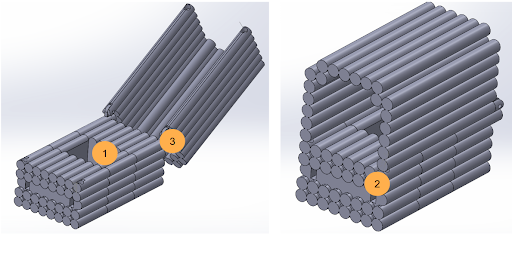
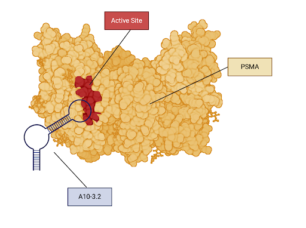
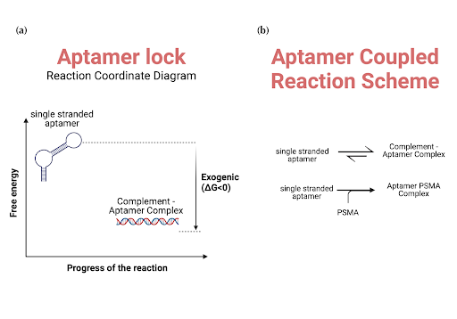

import ReferenceList from "@/components/ReferenceList.astro";
import { Steps } from "@astrojs/starlight/components";

## Background

DNA origami structures excel as modular nanostructures that can be used to precisely deliver therapies, like those for prostate cancer, largely due to their programmability, biocompatibility, and ability to navigate complex tumor environments (Zhou et al., 2023). In DNA origami, single-stranded DNA scaffolds spontaneously bind to shorter staple strands through complementary base pairing, forcing the scaffold to fold into desired 2D or 3D structures with nanometer precision (Rothemund, 2006). These structures can range from static docking platforms for different proteins to more complex dynamic structures that change conformation depending on their environment (Ouyang et al., 2017; Douglas et al., 2012). Herein, the dynamic and static attributes of DNA origami were used to create a high-precision, targeted delivery system of an immunotherapy for prostate tumors.

The idea of using DNA origami as a drug delivery tool was first popularized by Douglas et al. (2012). They designed a system for transporting molecular payloads to cells. Upon reaching the cell, overhangs from their DNA origami structure would interact with the cell surface receptors. If the receptors specific to their device are not present, the DNA origami would remain closed. On the other hand, if receptors specific to their design were present, their structure would open to expose a therapeutic payload. Such conditional activation could involve either IF or AND logic, the former requiring one receptor to be present for activation and the latter two.

We aimed to adapt their system for prostate cancer immunotherapy. Our design features a box with two states: open and closed. In the closed state, the payload is securely contained, while in the open state, it is exposed to the environment. In our application of this design, the box stores a specific T-cell targeting antibody (anti-CD3), and safely delivers it to cancer cells. During transit, it remains closed and only opens upon contact with two prostate-specific membrane antigens (PSMA) present on the surface of cancerous prostate cells, exposing the anti-CD3 antibody T-regs which in turn redirect cytotoxic T-cells to target and destroy the cancer cells.

## Objective

Our goal was to design a dynamic nanostructure that uses a lock and key mechanism to deliver anti-CD3 antibodies to prostate cancer tissues, tagging them for T-cells. Our design was inspired by the nanorobot first introduced by Douglas et al. (2012), which featured a clamshell-like structure that opened and delivered a molecular payload upon binding to receptors. We adapted this structure to include a docking platform specific to a prostate cell antibody and a lock and key mechanism specific to prostate cancer cells using CaDNAno software. The updated structure was then validated for 3D conformational stability using CAnDo, and its ability to safely bind the antibody was verified using Haddock.

## Our Design

Our carrier serves as the interface that links the prostate cancer (PC) cell to either a cytotoxic T-lymphocyte (CTL) or a T-helper (Th) cell (Gaglia & Kissler, 2019). Our carrier incorporates several key features that allow it to carry out its task as the linking interface between these cells.

|                                                                                                                           
 
                                                                                                                            |
| :-------------------------------------------------------------------------------------------------------------------------------------------------------------------------------------------------------------------------------------------------------------------------------------------------------------------------------------------------: |
| **_Figure 1:_** _Labeled diagram of the DNA origami carrier. Main features include 1) a central well with modified staple strands for anti-CD3 antibody docking, 2) an aptamer-mediated lock system, and 3) a hinge mechanism. The anti-CD3 antibody is enclosed by a DNA “lid” structure to prevent premature non-specific binding to CTL and Th._ |

### Aptamer-Mediated Lock System

To control the opening and closing of the carrier, a lock mechanism using two copies of the A10-3.2 RNA aptamer – which are specific to Prostate Specific Membrane Antigen (PSMA) – was developed (Min et al., 2011). Aptamers are short, single-stranded DNA or RNA molecules that bind to specific targets with high affinity and specificity, as they are formed by folding into unique three-dimensional structures that fit precisely with their targets (Nimjee et al., 2017). In this case, the PSMA-specific RNA aptamers bind to the PSMA protein as shown in Figure 2.

|                                                                                                          
 
                                                                                                          |
| :-----------------------------------------------------------------------------------------------------------------------------------------------------------------------------------------------------------------------------------------------------------------------------------------------------------------------: |
| **_Figure 2:_** _A visualization of the interaction between the aptamer A10-3.2 and PSMA. PSMA is the yellow colored protein in this image and the A10-3.2 is the blue colored DNA strand. The active site of PSMA is labeled in red. The expected binding site between the A10-3.2 aptamer and PSMA is the active site._ |

When in isolation, RNA aptamers adopt a unique tertiary structure that enables high-specificity binding to its intended biological target. However, when exposed to a complementary RNA or DNA strand, they hybridize to form a double-stranded nucleotide sequence (Douglas et al., 2012). This causes them to lose their single stranded tertiary structure and ability to bind to its intended biological target. This phenomenon is illustrated in the qualitative figure below.

This behavior is demonstrated thermodynamically below, showing the energy difference between the double-stranded (hybridized) state and the single-stranded (unhybridized) state. These results are supported by the findings of Douglas et al. (2012). The double-stranded state has a lower energy level, indicating a preference for hybridization.

We exploited this phenomena by incorporating aptamers attached via phosphodiester bonds into the staple strands of our AND box, allowing direct integration into the staples of our DNA origami structure. The aptamer complements were similarly hybridized to the staples. The staple-aptamer strands were positioned at the edge of the box on the base side, opposite the hinge, allowing the aptamers to overhang from the box and interact with the environment. The complements were similarly positioned, but on the lids instead. This configuration ensures that when the aptamer and complement hybridize, the lid and base come together to close the box. However, when bound to PSMA, the aptamer and complement would release, allowing the box to open. This setup allows the box and its payload to remain attached to PSMA-positive cells via aptamer binding.

Now, consider coupling this hybridization reaction with the aptamer binding to PSMA. When the aptamer comes into contact with PSMA, it binds to the protein, depleting the pool of unbound aptamers and shifting the equilibrium toward the bound state. This continues until all unbound aptamers are bound to PSMA. Since the aptamer overhangs are bound to the AND box, this results in the box being bound to PSMA and, hence, prostate tissue.

|                                                                                                                                                                                                                                                     
 
                                                                                                                                                                                                                                                     |
| :-------------------------------------------------------------------------------------------------------------------------------------------------------------------------------------------------------------------------------------------------------------------------------------------------------------------------------------------------------------------------------------------------------------------------------------------------------------------------------------------------------------------------------------------------------------------------------------------------------------: |
| **_Figure 3:_** _A qualitative analysis of the binding scheme of the A10-3.2 aptamer with its complement and PSMA. (a) The energy diagram for the single-stranded A10-3.2 aptamer and its double-stranded complement complex. The complement has a lower energy than the single-stranded aptamer. (b) The coupled reaction system involved in the aptamer binding to PSMA. The first reaction represents the equilibrium between the unhybridized aptamer and its double-stranded hybridized form. The second reaction shows the unhybridized aptamer binding to PSMA to form a complex in a one-way reaction._ |

As a result of the hinge design discussed below, the PSMA-aptamer binding acts as a one-way reaction, ensuring that the lock mechanism only activates when both aptamers are engaged simultaneously with their respective target sites. This design allows for better control of the box's opening.

### Hinge Mechanism

The hinge design involves taking two linear strands of DNA and bending them 180° to create a hinge. In practice, CanDo conformational models showed this value was likely around 150°. The angle strain in the DNA strands stores potential energy, similar to a spring-loaded hinge. These strands are held closed by the aptamer locks discussed earlier. Once the correct conditions are met, the hinge releases, exposing the anti-CD3 Antibody payload. Additionally, the linear form of DNA minimizes the chance of the lid closing after opening allowing for maximal effect at the target site.

During box formation, this conformation would be stabilized using a series of guide staples, allowing the aptamer lock to hybridize with its complement, closing the box as first described by Douglas et al. (2012). Once the aptamer locks close, the guide staples are removed. Although removing the guidestaples does encourage unwanted opening of the box, Douglas et al. (2012) found that the hybridization of the aptamer lock and its complement was sufficient to keep the hinge in a bent conformation for the therapeutic window of the treatment. Upon binding of the aptamer to PSMA, the stabilizing hybridization between the aptamer and its complement disappears, and the shear angle strain exerted on the DNA hinge forces it to straighten out, opening the box’s lid and exposing the molecular payload, an anti-CD3 antibody, to the environment.

Once the aptamer locks close, the guide staples are removed meaning that the carrier remains closed purely through the hybridization of the aptamer lock and its complement. Upon binding of the aptamer to PSMA, the stabilizing hybridization between the aptamer and its complement disappears, and the angle strain exerted on the DNA hinge forces it to straighten out, opening the carrier’s lid and exposing the molecular payload, an anti-CD3 antibody, to the environment.

### Anti-CD3 Antibody Loading Mechanism

With the box mechanism established, we now address how the anti-CD3 antibody payload will be docked within the AND box. Given the unidirectional hinge, it’s not feasible to repeatedly open and close the box for loading the anti-CD3. Therefore, an extension platform was created to raise the lid, allowing holes on either side of the box for the diffusion of the anti-CD3 antibody into the docking site. These openings, measuring 18 nm by 16 nm, are larger than the anti-CD3 antibody, which is less than 10 nm in size (Arnett et al., 2004), enabling the antibody’s effects to reach the environment and nearby cells.

### Docking Platform and Well

The docking platform composes the majority of the DNA box. In effect, it acts as a stable base to allow for the binding of the anti-CD3 antibody to the structure. This platform includes a well intended to position the antibody within the structure that has been shown by previous research to improve the orientation of the anti-CD3 antibody binding site for maximal therapeutic effect (Ouyang et al., 2017). Furthermore, the platform dimensions are several times larger than the anti-CD3 fragment to help prevent the payload from overhanging the sides of the box, which could otherwise trigger an immune response when the lid is closed.

The central well features 3’-amino-modified staple strands, providing a location for the anti-CD3 antibody to attach. The bond between the anti-CD3 antibody and the DNA origami carrier is facilitated by a linker molecule called bifunctional bis-succinimidyl suberate (BS3). After treating the carriers with BS3 linkers, lysine residues on the anti-CD3 antibody will be able to bind to the BS3 linkers, creating a stable bond between the carrier and the anti-CD3 antibody (Ouyang et al., 2017).

## Workflow Overview

Designs for our final origami structure were developed in CaDNAno 2. Our design process consisted of 8 key steps:

<Steps>

1. **Establish Design Requirements and Evaluation Criteria:** We first defined the key functionalities of the DNA origami box and how the design’s success will be measured. This mainly involved researching surface receptors present in prostate cancer cells that we could target as well as potential antibodies that can elicit an immune response. See [Antibody and Aptamer Attachment](/ideas/design-process-and-logic/antibody-aptamer-selection/).

1. **Review Existing Origami Structures:** After defining the requirements, we analyzed established designs that meet some of the established requirements and criteria for our project. This included researching peptide-nucleic acid docking techniques, DNA hinge designs, and aptamer-based locks.

1. **Sketch Initial Ideas:** We then created preliminary sketches of the structure on paper, focusing on the design of the lattice, the outline of the scaffold, and key functionalities. Out of six possible designs, two were selected for further development based on the initial screening.

1. **Determine Lattice: Using CaDNAno 2, we developed a general shape for the origami lattice. Two lattices were created:** one for a honeycomb structure and another for a square base.

1. **Design Scaffold:** We then designed the structure of the continuous scaffold that will fit into the lattice designed in step 4.

1. **Place Staples:** Once scaffold was designed, we identify the positions where the shorter staple strands will hybridize with the long scaffold strand to achieve the desired structure. For each lattice, staple strands were created and iterated until the mean RMSF value was below 2.0 (units).

1. **Analyze Conformational Stability:** Next we evaluated the stability of the designed structure to identify any potential weak points or errors. A CAnDo simulation was performed to analyze stability and pinpoint weak areas following the creation of new staples.

1. **Iterate and Refine:** This process involves continuously refining and optimizing the design to enhance its stability and functionality. The entire process of designing the box took five months.

</Steps>

## References

<ReferenceList>

Douglas, S. M., Bachelet, I., & Church, G. M. (2012). A Logic-Gated Nanorobot for Targeted Transport of Molecular Payloads. Science, 335(6070), 831–834. https://doi.org/10.1126/science.1214081
Gaglia, J., & Kissler, S. (2019). Anti-CD3 Antibody for the Prevention of Type 1 Diabetes: A Story of Perseverance. Biochemistry, 58(40), 4107–4111. https://doi.org/10.1021/acs.biochem.9b00707
Min, K., Jo, H., Song, K.-M., Cho, M., Yang Sook Chun, Jon, S., Won Ho Kim, & Ban, C. (2011). Dual-aptamer-based delivery vehicle of doxorubicin to both PSMA (+) and PSMA (−) prostate cancers. Biomaterials, 32(8), 2124–2132. https://doi.org/10.1016/j.biomaterials.2010.11.035
Nimjee, S. M., White, R. R., Becker, R. C., & Sullenger, B. A. (2017). Aptamers as Therapeutics. Annual Review of Pharmacology and Toxicology, 57, 61–79. https://doi.org/10.1146/annurev-pharmtox-010716-104558
Ouyang, X., De Stefano, M., Krissanaprasit, A., Bank Kodal, A. L., Bech Rosen, C., Liu, T., Helmig, S., Fan, C., & Gothelf, K. V. (2017). Docking of Antibodies into the Cavities of DNA Origami Structures. Angewandte Chemie International Edition, 56(46), 14423–14427. https://doi.org/10.1002/anie.201706765
Rothemund, P. W. K. (2006). Folding DNA to create nanoscale shapes and patterns. Nature, 440(7082), 297–302. https://doi.org/10.1038/nature04586
Zhou, Y., Dong, J., & Wang, Q. (2023). Fabricating higher-order functional DNA origami structures to reveal biological processes at multiple scales. NPG Asia Materials, 15. https://doi.org/10.1038/s41427-023-00470-3

</ReferenceList>
