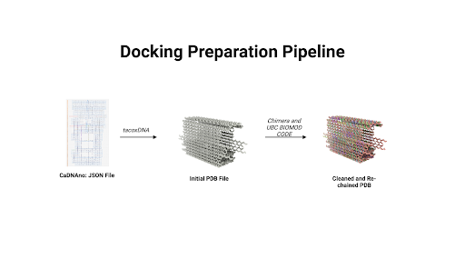
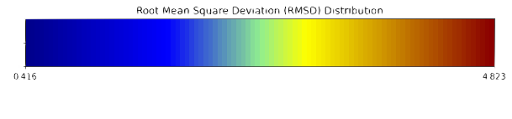

import { Steps } from "@astrojs/starlight/components";
import ReferenceList from "@/components/ReferenceList.astro";

To assess the AND box’s design, we used a variety of computational tools along with internal pipelines to assess stability and binding energies. In particular, we used CanDo&copy; to evaluate the stability of the box’s structure and HADDOCK&copy; docking models to assess the attachment of the anti-CD3 antibody to our DNA origami box.

## CanDo&copy; Stability Model

During the design process for the AND box, we used CanDo&copy; to assess the box’s stability and pinpoint areas for improvement. This tool measures the stability of DNA origami structures through root mean square fluctuations (RMSF) (Kim et al., 2012). RMSF is a measure of the average deviation of a point on the molecules from its ideal position as illustrated below. Larger RMSF values indicate lower stability.

After each iteration of our staple design, a CanDo&copy; model was generated to assess the structural stability and mechanical properties of the closed AND box. Each CanDo&copy; model includes raw RMSF values and stability maps. With the raw RMSF values, a t-test can be used to determine if design modifications lead to an overall increase in global stability. The stability map provides a computational prediction of regional structural stability and the topology of the DNA origami design. Such maps were used to pinpoint areas of low stability (high RMSF values) to be iterated on in future staple design. These iterations helped remove kinetic traps and sandwich strands, and ultimately improved the stability of the AND box.

## HADDOCK&copy; Docking Model

In addition to CanDo&copy;, we used docking models to characterize conformation of the anti-CD3 antibody with our box. Docking is a computational method that helps us predict the most probable locations and conformations of two nanostructures when they interact. Specifically, we used HADDOCK&copy; for the docking of the anti-CD3 antibody and our box (Honorato et al., 2021; Honorato et al., 2024). This helps us visualize the orientation of the anti-CD3 antibody within our DNA origami structure and predict its binding affinity to the box.

Given that the BS3 docking mechanism had been previously validated by Ouyang et al. (2017), our team was confident that the covalent bond was strong and chemically possible. Hence, we developed models to ensure that any steric hindrance or electrostatic interactions between our box and the antibody did not interfere with the formation of the bond.

## Preparation for Docking

The first step in running a docking model was synchronization of files. Since the output of cadnano&copy; is a JSON file and docking programs like HADDOCK&copy; cannot process such files, our team needed to find a way to convert the JSON file into a format that HADDOCK&copy; could read. Hence, we developed a custom pipeline to convert the JSON file into mmCIF files which can be processed by HADDOCK&copy;. This pipeline involved using a mixture of existing software along with proprietary code. The overall flow of the pipeline is illustrated below.

| 
 
 |
| :------------------------------------------------------------------------------------------------------------------------: |
|         **_Figure 1:_** _The workflow used for converting JSON files into cleaned and rechained PDBx/mmCIF files._         |

The pipeline flow we developed to convert cadnano JSON files to mmCIF is as follows:

<Steps>

1. **TacoxDNA:** We began by using tacoxDNA to export the box as a PDB file (Suma et al., 2019). TacoxDNA assigns a new chain to each staple of our design; however, because PDB files support only 26 chains, the output encountered chaining issues. Additional problems included missing strands, structural gaps, and non-standard residue names.
1. **ChimeraX:** To address these issues, we processed the tacoxDNA PDB output in ChimeraX, making adjustments such as adding hydrogens and removing hydrides.
1. **Custom Scripts:** Next, we used custom BioPython scripts to resolve chain numbering issues that arose during the JSON-to-mmCIF conversion (Cock et al., 2009).
1. **Manual Editing:** Finally, we manually edited the mmCIF file in a text editor to correct any remaining format issues.

</Steps>

The result of this workflow was a rechained mmCIF file with modifications for docking. This modified file was loaded into HADDOCK&copy; with spatial and active residue constraints, generating binding energy calculations focused on docking at the cavity, where a covalent bond would form. Spatial and residue constraints ensured that the interactions measured occurred within the DNA well where the bs3 bond would occur. Importantly, constraint violation energies were recorded to validate these assumptions. These energies provide a quantitative measure of how much the system deviates from these constraints; hence, if these values are negative, it indicates that the deviation is favorable and that the constraints are unreasonable. We did not explicitly model the covalent bond, as the aim was to assess steric challenges related to docking.

## Results

### CanDo&copy; Models

According to CanDo&copy; simulations, a successfully formed DNA box should take on the conformations shown in Figures 1 a-d (Kim et al., 2012). These predictions show that the general shape/confirmation of the box is as originally planned. Darker blue regions indicate lower RMSF values and, hence, higher stability. On the other hand, darker red regions indicate higher RMSF values and, hence, lower stability. Based on this, the docking platform is predicted to be the most stable part of the design followed by the upper portions of the lid. As expected the hinge has the highest RMSF due to the angle strain introduced by the design. Lastly, overhangs and sections near the ends of the box are red as there is little adjacent DNA to force these sections close allowing for more degrees of freedom for deviation. In all, the results illustrated a fairly stable design with areas of instability that could be overcome with proper thermal ramp protocols.

|                
 
                 |
| :-------------------------------------------------------------------------------------------------------------------------------------------------------------------------------------------------------: |
| **_Figure 2:_** _Multiple views of a heatmap of the DNA box. Red indicates areas of low stability, while blue indicates areas of high stability. a) (top-left) Spinning view of DNA box. b) (top-right)._ |

The descriptive statistics of the RMSF values indicate an average deviation of approximately 1 nm, or roughly half of a base pair. With a standard deviation around 0.47 nm, most of the design (>99%) remains below 2 nm RMSF. As expected, the maximum RMSF of 4.8 nm occurs at the hinges where DNA angle strain is high. Overall, these values align with literature standards and indicate a conformationally stable design (Snodin et al., 2019).

    | **Statistic** | **Value (nm)** |
    | :---------------: |:-----------:|
    | Mean  | 1.0505089435483872      |
    | Median  | 0.933812   |
    | Standard Deviation      | 0.47092742110452673    |
    | Minimum      | 0.415867    |
    | Maximum     | 4.82252      |

### HADDOCK&copy; Models

Docking analysis showed favorable electrostatic and van der Waals interactions between the anti-CD3 antibody and the box cavity. The positive constraint energy, representing the energy needed to break the spatial constraint, indicates that the initial spatial constraints which ensured that the anti-CD3 rested in the well are appropriate. These findings suggest that the anti-CD3 antibody is well-positioned within the cavity, with its binding site pointing up, and we expect the addition of a covalent bond with BS3 to further enhance stability, as supported by the findings of Ouyang et al. (2017).

It's important to note that HADDOCK&copy; standardizes its energy values, so while the specific value has no direct interpretive meaning in terms of units of energy, a negative result still indicates thermodynamic favorability, and larger values are preferable. Notably the electrostatic energy is more negative than the van der Waals energy suggesting that the positive residues on the anti-CD3 antibody are interacting favorably with the negatively charged DNA.

    | **Properties** | **Values (Standardized)** |
    |:------------:|:------------:|
    | Van der Waals energy  | $$-47.6 \pm 3.8$$       |
    | Electrostatic energy       | $$-270.8 \pm 33.0$$       |
    | Restraints violation energy    | $$56.9 \pm 25.2$$  |

This table shows the standardized energy values from docking the anti-CD3 antibody into the DNA box cavity using HADDOCK&copy;. Both electrostatic and van der Waals energies are negative, indicating favorable interactions. Additionally, the positive restraint violation energy suggests that the spatial and conformational constraints applied to the system are appropriate and favorable.

## References

<ReferenceList>

Cock, P. J. A., Antao, T., Chang, J. T., Chapman, B. A., Cox, C. J., Dalke, A., Friedberg, I., Hamelryck, T., Kauff, F., Wilczynski, B., & de Hoon, M. J. L. (2009). Biopython: freely available Python tools for computational molecular biology and bioinformatics. Bioinformatics, 25(11), 1422–1423. https://doi.org/10.1093/bioinformatics/btp163
Douglas, S. M., Bachelet, I., & Church, G. M. (2012). A Logic-Gated Nanorobot for Targeted Transport of Molecular Payloads. Science, 335(6070), 831–834. https://doi.org/10.1126/science.1214081
Douglas, S. M., Dietz, H., Liedl, T., Högberg, B., Graf, F., & Shih, W. M. (2009). Self-assembly of DNA into nanoscale three-dimensional shapes. Nature, 459(7245), 414–418. https://doi.org/10.1038/nature08016]
Honorato, R. V., Koukos, P. I., Jimenez-Garcia, B., Tsaregorodtsev, A., Verlato, M., Giachetti, A., Rosato, A., & Bonvin, A. M. J. J. (2021). Structural biology in the clouds: The WeNMR-EOSC ecosystem. Frontiers in Molecular Biosciences, 8, Article 729513. https://doi.org/10.3389/fmolb.2021.729513
Honorato, R. V., Trellet, M. E., Jiménez-García, B., Schaarschmidt, J. J., Giulini, M., Reys, V., Koukos, P. I., Rodrigues, M., Ezgi Karaca, Zundert, van, Roel-Touris, J., Charlotte, Zuzana Jandová, Adrien, & Alexandre. (2024). The HADDOCK2.4 web server for integrative modeling of biomolecular complexes. Nature Protocols, 19. https://doi.org/10.1038/s41596-024-01011-0
Kim, D. N., Kilchherr, F., Dietz, H., & Bathe, M. (2012). Quantitative prediction of 3D solution shape and flexibility of nucleic acid nanostructures. Nucleic acids research, 40(7), 2862–2868. https://doi.org/10.1093/nar/gkr1173
Ouyang, X., De Stefano, M., Krissanaprasit, A., Bank Kodal, A. L., Bech Rosen, C., Liu, T., Helmig, S., Fan, C., & Gothelf, K. V. (2017). Docking of Antibodies into the Cavities of DNA Origami Structures. Angewandte Chemie International Edition, 56(46), 14423–14427. https://doi.org/10.1002/anie.201706765
Snodin, B. E. K., Schreck, J. S., Romano, F., Louis, A. A., & Doye, J. P. K. (2018). Coarse-grained modelling of the structural properties of DNA origami. Nucleic Acids Research, 47(3), 1585–1597. https://doi.org/10.1093/nar/gky1304
Suma, A., Poppleton, E., Matthies, M., Šulc, P., Romano, F., Louis, A. A., Doye, J. P. K., Micheletti, C., & Rovigatti, L. (2019). TacoxDNA: A user-friendly web server for simulations of complex DNA structures, from single strands to origami. Journal of Computational Chemistry, 40(24), 2586–2595. https://doi.org/10.1002/jcc.26009

</ReferenceList>
