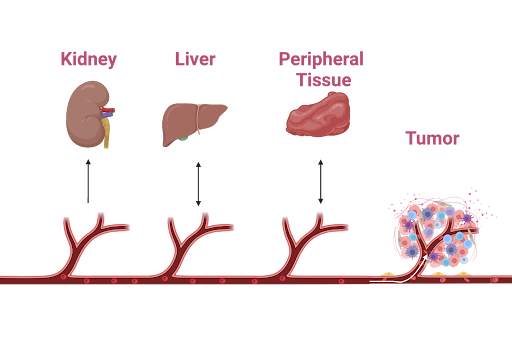
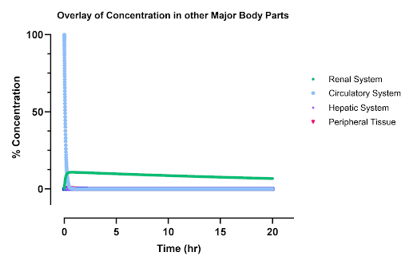
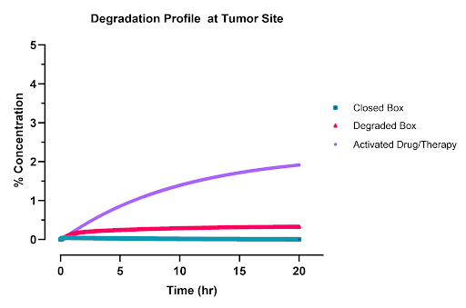
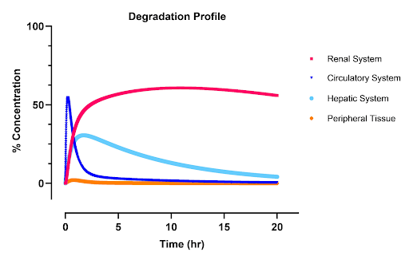
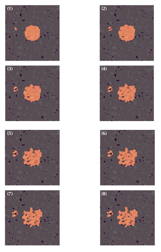

import ReferenceList from "@/components/ReferenceList.astro";
import { Aside } from "@astrojs/starlight/components";
import { Steps } from "@astrojs/starlight/components";

To guide future in vivo testing of the AND box, we employed pharmacokinetic techniques and principles of mass transport to understand therapeutic, toxicological, and pharmacological properties of our AND box in the human body. By exploring side effects and degradation, we aim to determine ideal modes of delivery for future in vivo experiments.

## Pharmacokinetics

Pharmacokinetics is a branch of pharmacology that focuses on the kinetics of drugs in the body, specifically studying absorption, distribution, metabolism, and excretion of foreign substances in the body. As a quick summary of these processes, absorption describes how drugs enter systemic circulation, distribution refers to how they reach their site of action, metabolism involves the chemical alterations drugs undergo in the body, often by enzymes, and excretion addresses how these substances are eliminated. Throughout each phase, the body's immune system, tissues, and cells are continually reacting to get rid of the foreign substance causing some degree of stress on the tissues (Anderson et al., 2008). A clear understanding of these processes may help overcome challenges associated with overdose and foreign body over-reactions. In this section, the terms box, AND box, drug, and treatment are used interchangeably.

## Routes of Administration

We modeled both systemic and locoregional routes of administration. Systemic delivery refers to the administration of a drug or therapeutic agent into the bloodstream, allowing it to circulate throughout the body to reach target tissues or cells. The alternative is locoregional delivery which attempts to avoid systemic circulation and localize the effects of their drug to specific tissue, reducing off-target effects.

## Models

We developed two models for the delivery of the AND box; one systemic and one locoregional. For systemic delivery we ignored the absorption mechanism and only focused on distribution, metabolism and excretion. For locoregional delivery, we developed a diffusion model that used computer generated histological sections of prostate cancer tissue to model the diffusion of the AND box and understand its spatial distribution in tissue.

### Model 1

#### Set-up:

For our systemic drug model, we developed a five-compartment pharmacokinetic model which includes the prostate tumor, circulatory system, hepatic system, urinary system, and peripheral tissue. When selecting the compartments, we prioritized body systems where degraded drug products might accumulate and could pose potential toxicological risk. Given that the AND box is designed to transport a pro-inflammatory antibody, namely anti-CD3 antibody, degradation of the nanostructure could expose cytokines to off-target tissues, potentially causing inflammation— a major challenge in immunotherapies (Singh et al., 2021). Therefore, determining the relative percentage of degraded drug to the initial dose in various compartments, may help establish maximum dosing limits in future experiments and, consequently, provide early insights into the treatment's efficacy.

The primary degradation mechanism of the DNA nanostructure box was assumed to be enzymatic, driven by DNA nucleases in our case (DNases). This assumption aligns with observed degradation trends in other nano-scale delivery systems, which also experience degradation from enzymes (Xiong et al., 2005). The liver exhibits significantly higher nuclease activity compared to other body compartments, which could lead to degraded drug accumulation in the liver and pose a risk of hepatitis (Francis & Navarro, 2024). Additionally, the kidneys filter blood containing both intact and degraded drug products, resulting in substantial processing and accumulation of these drugs within the renal system, potentially causing nephritis and cystitis (Kim & moon, 2012). Therefore, it is logical to analyze these two compartments separately. In other peripheral tissues, inflammation was less of a concern and, hence, these were combined into a single compartment. We assumed that all transport in our model occurs through the circulatory system and excretion occurs via the renal system. Finally, we modeled the tumor as a separate compartment to test the efficacy of our treatment. The entire model, including these interactions, is shown in figure 1.

|                                                                                                                <div className='flex flex-row justify-center'> </div>                                                                                                                |
| :---------------------------------------------------------------------------------------------------------------------------------------------------------------------------------------------------------------------------------------------------------------------------------------------------------------------------------------------------------: |
| **\*Figure 1:** An illustration of the compartments in the pharmacokinetics model. The drug is transported bidirectionally in the liver and peripheral tissue, while it is transported unidirectionally in the tumor and kidney. Degradation reactions occur in the liver, circulatory system, and peripheral tissue. The drug is activated in the tumor.\* |

We modeled each transport phenomena and reaction interaction as a series of first-order reactions with respect to the concentration of drug in the compartments. Transport phenomena refers to movement of molecules from one compartment to another (i.e. circulatory system to hepatic system). Reactions refer to irreversible chemical alterations to the AND box. For the reactions, we assumed the limiting factor is the availability of our AND box and, hence, the compartment's degradation process as a first-order reaction. Additionally, mass transfer between compartments was assumed to be linear due to the diffusive nature of the transport (details discussed later). This means that our model contains a series of first-order reactions with specific rate constants (K). Renal clearance was modeled as a unidirectional process, and we assumed that the tumor retained all nanoparticles due to the enhanced permeability and retention (EPR) effect (Wu, 2012). This gave rise to the following system of 11 ordinary differential equations and 24 parameters.

<Steps>
1. Renal Compartments:

    ```math
    \begin{align*}
    V_r \cdot \frac{dB_r}{dt} &= V_c \cdot K_{cr}^B \cdot B_c - V_r \cdot k_{e}^B \cdot B_r \\
    V_r \cdot \frac{dD_r}{dt} &= V_c \cdot K_{cr}^D \cdot D_c - V_r \cdot k_{e}^D \cdot D_r
    \end{align*}
    ```

1. Circulatory Compartments:

   ```math
   \begin{align*}
   V_c \cdot \frac{dB_c}{dt} &= V_l \cdot K_{kc}^B \cdot B_l + V_o \cdot K_{oc}^B \cdot B_o - V_c \cdot B_c \cdot (K_{cr}^B + K_{ck}^B + K_{co}^B + K_{ct}^B + K_c) \\
   V_c \cdot \frac{dD_c}{dt} &= V_l \cdot K_{kc}^D \cdot D_l + V_o \cdot K_{oc}^D \cdot D_o - V_c \cdot D_c \cdot (K_{cr}^D + K_{ck}^D + K_{co}^D + K_{ct}^D) + V_c \cdot K_c \cdot B_c
   \end{align*}
   ```

1. Liver Compartments:

   ```math
   \begin{align*}
   V_l \cdot \frac{dB_l}{dt} &= V_c \cdot K_{ck}^B \cdot B_c - V_l \cdot B_l \cdot (K_{kc}^B + K_l) \\
   V_l \cdot \frac{dD_l}{dt} &= V_c \cdot K_{ck}^D \cdot D_c - V_l \cdot D_l \cdot K_{kc}^D + V_l \cdot K_l \cdot B_l
   \end{align*}
   ```

1. Tumor Compartment:

   ```math
   \begin{align*}
   V_t \cdot \frac{dB_t}{dt} &= V_c \cdot K_{ct}^B \cdot B_c - V_t \cdot (K_T + K_T') \cdot B_t \\
   V_t \cdot \frac{dD_t}{dt} &= V_c \cdot K_{ct}^D \cdot D_c + V_t \cdot K_T \cdot B_t
   \end{align*}
   ```

1. Tissue Compartments:

   ```math
   \begin{align*}
   V_o \cdot \frac{dB_o}{dt} &= V_c \cdot K_{co}^B \cdot B_c - V_o \cdot B_o \cdot (K_o + K_{oc}^B) \\
   V_o \cdot \frac{dD_o}{dt} &= V_c \cdot K_{co}^D \cdot D_c - V_o \cdot D_o \cdot K_{oc}^D + V_o \cdot K_o \cdot B_o
   \end{align*}
   ```

1. Drug Activation:

   ```math
   \begin{align*}
   V_t \cdot \frac{dA}{dt} &= K_T' \cdot B_t
   \end{align*}

   ```

   </Steps>

#### Parameters:

To determine the model parameters, two separate procedures were followed. It is important to note that these parameters are only estimates and assumptions had to be made along the way, since not all of the data specific to the AND box exists.

First, to estimate transport rate constants, we utilized permeability values of capillaries. Since all transport in our model occurs through the circulatory system, we assigned a single permeability value for the entire system corresponding to the average permeability of capillaries. Permeability is defined as the net flux across a membrane divided by the concentration difference between the two sides . Thus, multiplying the permeability by the concentration difference gives the net flux through the membrane, as shown below (Friedman, 2008).

    ```math
    \begin{align*}
    J &= P \cdot \Delta C
    \end{align*}
    ```

Since flux represents the amount of material transported per unit area per unit time, we can multiply either side by area to get the concentration of material transported as a function time. The resulting equation shows that the transport is first order with respect to concentration, consistent with our earlier assumptions. The first term represents the total input and the second output. The rate constant is the product of permeability and membrane area. Notably, the rate constant is symmetric for forward and reverse transport which simplifies our system and reduces the number of equations to 14 parameters.

    ```math
    \begin{align*}
    \frac{\partial C}{\partial t} &= P \cdot A \cdot (C_f - C_o) = P \cdot A \cdot C_f - P \cdot A \cdot C_o
    \end{align*}
    ```

Furthermore, we assumed that the permeability properties of our DNA nanostructure box remained similar in both intact and degraded states, as the net molecular weight and charge, key determinants of permeability, did not change. This assumption allowed us to further reduce the number of parameters to 9.

To estimate the surface area of the capillaries, we took the total ratio of blood delivered to the compartment with the total blood in the body and multiplied it by the total surface area of capillaries in the body. This gave a rough estimate of the surface area of the capillaries in that compartment. Permeability values were derived from Sadipour et al. (2023).

<div className='flex flex-col items-center justify-center'>
| Compartment | Total Volume of Blood | Blood Ratio | Surface Area | Permeability | Transport Rate Constant $$cm^3/s$$ |
|:--------:|:--------:|:--------:|:--------:|:--------:|:--------:|
| Liver    | 660 ml/min (Wayne (2009)     | 0.132     | 792 $$cm^2$$     | $$1 x 10^-2 cm/s$$     | 7.92     |
| Kidney    | 1 L/min (Eaton & Pooler, 2023)     | 0.20     | 1200 $$cm^2$$     | $$1 x 10^-2 cm/s$$     | 12     |
| Tumor    | 2 ml/min  (Inaba, 1992; Leissner & Tisell, 1979)     | 0.0004     | 2.4 $$cm^2$$     | $$1 x 10^-2 cm/s$$     | 0.024     |
| Other Tissue    | 3.34 L/min (Sharma & Sharma, 2023)     | 0.668     | 4008 $$cm^2$$     | $$3.4 x 10^-4 cm/s$$     | 1.36272     |
| Total Flow    | 5 L/ min (Sharma & Sharma, 2023)     | 1     | 6000 $$cm^2$$ (BioNumber, nd.)     |  NA | NA     |

|                                                                                                                                                                                                                                                                                                                                                                                                                                    |
| :--------------------------------------------------------------------------------------------------------------------------------------------------------------------------------------------------------------------------------------------------------------------------------------------------------------------------------------------------------------------------------------------------------------------------------: |
| **\*Table 1:** Tabulated transport constants for movement to and from different body compartments to the circulatory system were used. The average permeability value was applied for most tissues, with the exception of peripheral tissue, where the permeability of adipose tissue reduced the overall value. Surface area was estimated by multiplying the ratio of blood delivered to the tissue by the total surface area.\* |

</div>

<div className='flex flex-col items-center'>
    To estimate reaction rate constants, we applied the small substrate assumption to the Michaelis-Menten equation (Nelson & Cox, 2004). At low substrate concentrations, the reaction becomes substrate-limited, following first-order kinetics with a rate constant equal to Vmax/Km. The values, prioritized from prostate cancer sources over solid tumors or healthy individuals, are provided in the table below. Since  Km is an enzyme-specific property, the same value was used across all compartments. Vmax depends on the concentration of the enzyme and, hence, is compartment specific.
    | Compartment | Km | Vmax |
    |:--------:|:--------:|:--------:|
    | Circulatory System | 0.68 $$\mu$$Mol (Rories & Carter, 1986) | 1.0 $$\mu$$Mol (Cherepanova et al., 2008) |
    | Hepatic System | 0.68 $$\mu$$Mol (Rories & Carter, 1986) | 45 $$\mu$$Mol (Golonka et al., 2018) |
    | Tumor and Peripheral Tissue | 0.68 $$\mu$$Mol (Rories & Carter, 1986) | 0 $$\mu$$Mol  |

    | |
    | :--: |
    | ***Table 2:** Tabulated kinetics parameters for endonuclease-mediated breakdown of the AND box.* |

</div>

#### Results:

The concentration profiles in figures 2-4 represent the results from this pharmacokinetics analysis.

##### Organ Systems Analysis

Inactive (pro) Drug: Due to the higher renal clearance rate compared to renal elimination rate, the peak concentration in the kidneys is higher relative to other compartments. Peripheral tissues exhibit low absorption rates, attributed to their lower effective permeability. The hepatic system also experiences lower levels of the inactive drug due to the fact that the inlet and outlet rate constants are the same and that the drug is also regarded rapidly in the liver. In the circulatory system, an exponential decay is observed as the drug is gradually cleared into other compartments and eliminated from the body. The system’s time constant of approximately 20 minutes aligns with literature values (Hoshyar et al., 2016).

Degraded Drug: Similarly, the degraded drug shows a lower peak concentration in the kidneys, influenced by high renal clearance. Other tissues have limited absorption due to reduced permeability. The total concentration of degraded drugs in the body peaks around 40 minutes. The high blood flow to the liver leads to a notable accumulation in that compartment, as the hepatic system degrades the drug faster than it is removed, causing an initial concentration peak that gradually declines to zero. This leads to similar degradation profiles in the blood which are slightly right shifted as drug is first reacted in the liver then the blood.

##### Total Drugs Analysis

Inactive Drug: The concentration of the inactive drug eventually reaches zero as all the drug molecules undergo reactions, leaving no residual amount in the system. This behavior reflects the complete conversion of the drug within the specified time frame.

Degraded Drug: The concentration of the degraded drug plateaus at around 0.9, indicating that 90% of the drug is metabolized or degraded in the body. This plateau suggests that a small fraction of the drug is accessible for actual reaction with the body. It is important to note that these are models that rely on data from generalized experiments on nanoparticles. The actual kinetics of the drug will likely differ from those seen here in the bioavailability of the drug and its half life. However, the general shape and order of magnitude of the model are accurate and provide insight into potential toxicological issues and treatment efficacy. The total peak of the degraded box in the circulatory system, liver, and kidney is 55%, 45%, and 35% of the initial dose respectively.

##### Tumor Drug Profile

The drug profile in the tumor shows that approximately 2% of the administered drug reaches the tumor and becomes activated for use. Additionally, 0.5% of the degraded carrier reaches the tumor site, which is functionally equivalent to the presence of an anti-CD3 antibody, thereby contributing to drug activation. Consequently, the total bioavailability of the drug stands at around 2.5%, which is relatively high for systemically administered nanoparticle treatments.

|                                                                           <div className='flex flex-row justify-center'> </div>                                                                            |
| :------------------------------------------------------------------------------------------------------------------------------------------------------------------------------------------------------------------------------------------------------------: |
| **\*Figure 2:** The undegraded inactive AND box concentration profiles as a percentage of initial dose. The circulatory system is the blue line, renal system is the green line, hepatic is the purple line, and other peripheral tissues are the pink line.\* |

|                                                                        <div className='flex flex-row justify-center'> </div>                                                                        |
| :-----------------------------------------------------------------------------------------------------------------------------------------------------------------------------------------------------------------------------------------------------------------------------------: |
| **\*Figure 3:** AND box concentration profile in the tumor as a percentage of initial dose. The purple line is the activated open box , the red line is the degraded box, and the green line is the inactive closed box. Around 2.5% of the initial dose is activated in the tumor.\* |

|                                         <div className='flex flex-row justify-center'> </div>                                          |
| :--------------------------------------------------------------------------------------------------------------------------------------------------------------------------------------------------------: |
| **\*Figure 4:** Degradation profiles of the AND box as a percentage of the initial does. The renal system is red, the circulatory is blue, the hepatic is light blue, and peripheral tissues are orange.\* |

### Model 2

#### Equations of Transport In Tissue

To understand the concentration profile of our drug in the tissue, we need to consider two things: how the drug moves, how the drug is broken down.

**_How does the drug move?_**

In dense tissues such as tumors, most drugs move via simple diffusion, the movement of molecules from high to low concentrations. Fick's Law of Diffusion explains how molecules move from areas of high concentration to areas of low concentration (Friedman, 2008). It states that the rate at which molecules diffuse (spreads out) depends on two things: the concentration difference between two points and how easily the molecules can move through the medium to get to these points (called the diffusion coefficient).

The bigger the difference in concentration between two areas, the faster diffusion happens. This principle is used a lot in biology and chemistry to describe how substances like gasses, nutrients, or drugs spread through cells or tissues.

Mathematically, the 3D calculus behind Fick's Law involves a simple differential equation (Friedman, 2008). In one dimension, Fick's first law can be written as:

```math
\begin{align*}
J &= -D \nabla C
\end{align*}
```

<Aside>
    • J is the flux, which represents the amount of substance passing through a given area per unit time.

    • D is the diffusion coefficient, describing how easily the substance diffuses. Larger means easier to move

    • ∇C is the concentration gradient, or the rate at which concentration changes with respect to position.

</Aside>

The negative sign means that diffusion occurs from areas of higher concentration to areas of lower concentration. The steeper the concentration gradient the faster the flux.

To convert flux to changes in concentration, we apply Fick’s second law below (Friedman, 2008). Notice that the power rule applies if the diffusion coefficient is not constant as in our case

```math
\begin{align*}
\frac{\partial C}{\partial t} &= D(x, y) \nabla^2 C + \nabla D \cdot \nabla C
\end{align*}
```

<Aside>
    • $$\frac{\partial C}{\partial t}$$ is the rate of change of concentration with respect to time (how the concentration evolves over time).
   
    • $$D(x, y)$$ is the diffusion coefficient (how easily the substance diffuses). Larger indicates easier transport.
   
    • $$\nabla^2C$$ is the laplacian of concentration with respect to position, or the curvature of the concentration profile.
</Aside>

**_How is it broken down?_**

The Michaelis-Menton equation is used to describe how molecules, like drugs or ligands, bind to receptors or enzymes, and it captures the cooperative nature of this binding (Nelson & Cox, 2004). For low substrate concentrations, the equation simplifies into a first order reaction with respect to the drug. Hence, we got the following equation.

```math
\begin{align*}
\frac{\partial C}{\partial t} &= \frac{V_{\text{max}} \cdot C}{K_m}
\end{align*}
```

<Aside>
    • $$\frac{\partial C}{\partial t}$$ is the rate by which the drug is broken down.
    
    • $$C$$ is the concentration of the drug.
    
    • $$K_m​$$ is the dissociation constant, which represents the concentration of ligands at which half of the receptor sites are occupied.
</Aside>

Putting it all together:

```math
\begin{align*}
\frac{\partial C}{\partial t} &= D(x, y) \nabla^2 C + \nabla D \cdot \nabla C - \frac{V_{\text{max}}}{K_m} \cdot C
\end{align*}
```

If we count the number of parameters, we have 3 total parameters to describe our drug in tissue. We also have low penetration boundary conditions along with initial conditions for our system.

#### Discretization

Solving the equation derived above analytically is impossible! Hence, computers are needed to estimate the values of the equation above. The simplest technique that was used is the Euler method.

The Euler method is a straightforward numerical technique for solving differential equations. It works by approximating the solution step by step, starting from an initial condition and moving forward in small steps (called the step size).

The basic idea is to approximate the slope of the solution curve using the derivative at a given point, then use that slope to predict the next point. The equation for the Euler method is:

```math
\begin{align*}
C(x, y, t_{i+1}) &= C(x, y, t_i) + \frac{\partial C}{\partial t} \cdot \Delta t
\end{align*}
```

<Aside>
    • $$C(x, y, t_i)$$ is the current value of the function (the solution) at step $$i$$.
    
    • $$t$$ is the current value of time. 
    
    • $$\Delta t$$ is the step size, which determines how far forward we move in each step.

    • $$\frac{\partial C}{\partial t}$$ is the derivative of the function at the current point, which gives the slope of the curve at that point. We can calculate this using our equation above for each time point.

</Aside>

#### Parameters

To solve the model, a custom python script was created and the discretization techniques described above were employed. Tissue cross sections were generated like those below using stochastic techniques and gaussian filters. Some in these images notable features to account for are:

<Steps>
1. Dark purple areas represent the nuclei of cells.

1. Pink regions show the extracellular matrix and cytoplasm.

1. White spaces usually represent media.
   </Steps>

**_Determining Coefficients_**

Two different forms of coefficients were present: namely, transport and reaction. To determine transport coefficients, literature review was used to determine the diffusion coefficient of negatively charged nanoparticles in water and extracellular matrix. The diffusion coefficient in tissue was set to zero as it was assumed that minimal drug penetrated the membrane. The results are tabulated below.

<div className="flex flex-col items-center justify-center">
    | Category | Diffusion Coefficients |
    |:--------:|:--------:|
    | D1: Diffusion In Water | $$2 * 10^-12 m^2/s$$ (Khitab et al., 2017) |
    | D2: Diffusion In ECM | $$2 * 10^-15 m^2/s$$ (Lieleg et al., 2009) |
    | D3: Diffusion In Cells | 0 |

    | |
    | :--: |
    | ***Table 3:** Tabulated diffusion coefficient of negatively charged particles in water, the extracellular matrix, and in cells.* |

</div>

Next, we could not directly determine the reaction coefficients of the system as these were highly specific to our system and no experiment results were available. Hence, we used values so that the reaction time scale is similar to that of diffusion. Additionally, these reactions were only allowed in D3 areas and adjacent pixels where cells exist. This value was iterated to in the program and is specific to the tissue generated by the code as the length scale is also dependent on the tissue cross section.

|                                                                                                                                          <div className='flex flex-row justify-center'> </div>                                                                                                                                          |
| :--------------------------------------------------------------------------------------------------------------------------------------------------------------------------------------------------------------------------------------------------------------------------------------------------------------------------------------------------------------------------------------------------------: |
| **\*Figure 5:** A model of drug transport in computer-generated solid tumor tissues is shown in these images. Dark spots represent cancer cells, light pink areas indicate extracellular matrices, and white spots represent media. The orange overlay shows the concentration of drugs in the tissue. The images are ordered from (1) to (8), representing the temporal evolution of the drug in space.\* |

#### Results

The results in Figure 2 show the spatial development of the box as it spreads, concentrating around cells where it is consumed to activate T-Cells. These concentration profiles also show that the drug prefers to spread out through less dense tissues and tends to concentrate in areas of high water content, like the media. This is important because it suggests that the drug's distribution is influenced by tissue density and water content, which could impact its efficacy in targeting specific areas, such as tumor regions or areas with activated immune cells, and guide the optimization of drug delivery strategies.

## References

<ReferenceList>
  Anderson, J. M., Rodriguez, A., & Chang, D. T. (2008). Foreign body reaction
  to biomaterials. Seminars in immunology, 20(2), 86–100.
  https://doi.org/10.1016/j.smim.2007.11.004 BioNumbers. (n.d.). Total cross
  sectional area of capillaries - Human Homo sapiens - BNID 110559.
  Bionumbers.hms.harvard.edu.
  https://bionumbers.hms.harvard.edu/bionumber.aspx?s=n&v=4&id=110559
  Cherepanova, A. V., Tamkovich, S. N., Bryzgunova, O. E., Vlassov, V. V., &
  Laktionov, P. P. (2008). Deoxyribonuclease Activity and Circulating DNA
  Concentration in Blood Plasma of Patients with Prostate Tumors. Annals of the
  New York Academy of Sciences, 1137(1), 218–221.
  https://doi.org/10.1196/annals.1448.016 Eaton, D., & Pooler, J. (2023).
  Vander’s Renal Physiology, 10th Edition | AccessMedicine | McGraw Hill
  Medical. McGraw Hill; McGraw Hill.
  https://accessmedicine.mhmedical.com/book.aspx?bookid=3316 Friedman, M. H.
  (2008). Principles and Models of Biological Transport. Springer New York.
  https://doi.org/10.1007/978-0-387-79240-8 Golonka, R. M., Yeoh, B. S.,
  Petrick, J. L., Weinstein, S. J., Albanes, D., Gewirtz, A. T., McGlynn, K. A.,
  & Vijay-Kumar, M. (2018). Deoxyribonuclease I Activity, Cell-Free DNA, and
  Risk of Liver Cancer in a Prospective Cohort. JNCI Cancer Spectrum, 2(4).
  https://doi.org/10.1093/jncics/pky083 Hoshyar, N., Gray, S., Han, H., & Bao,
  G. (2016). The effect of nanoparticle size on in vivo pharmacokinetics and
  cellular interaction. Nanomedicine, 11(6), 673–692.
  https://doi.org/10.2217/nnm.16.5 Inaba, T. (1992). Quantitative measurements
  of prostatic blood flow and blood volume by positron emission tomography. The
  Journal of Urology, 148(5), 1457–1460.
  https://doi.org/10.1016/s0022-5347(17)36939-2 Khitab, A., Anwar, W., & Arshad,
  M. T. (2017). Predictive Models of Chloride Penetration in concrete: An
  Overview. MUST Journal of Engineering and Applied Sciences, 1(1), 1–14.
  https://doi.org/10.22496/mjeas20170103 Leissner, K. H., & Tisell, L. E.
  (1979). The weight of the human prostate. Scandinavian Journal of Urology and
  Nephrology, 13(2), 137–142. https://doi.org/10.3109/00365597909181168 Lieleg,
  O., Baumgärtel, R. M., & Bausch, A. R. (2009). Selective Filtering of
  Particles by the Extracellular Matrix: An Electrostatic Bandpass. Biophysical
  Journal, 97(6), 1569–1577. https://doi.org/10.1016/j.bpj.2009.07.009 Nelson,
  D. L., & Cox, M. M. (2004). Lehninger principles of biochemistry (4th ed.).
  W.H. Freeman. Rories, C. C., & Carter, C. W. (1986). Sensitive quantitation of
  endonuclease kinetics. Journal of Biochemical and Biophysical Methods, 12(3),
  147–159. https://doi.org/10.1016/0165-022x(86)90029-1 Sadipour, M., Momeni, M.
  M., & Soltani, M. (2023). Effect of hydraulic conductivity and permeability on
  drug distribution, an investigation based on a part of a real tissue.
  ArXiv.org. https://doi.org/10.48550/arXiv.2304.06273 Sharma, R., & Sharma, S.
  (2023). Physiology, Blood Volume. Nih.gov; StatPearls Publishing.
  https://www.ncbi.nlm.nih.gov/books/NBK526077/ W. Wayne Lautt. (2009). Hepatic
  Circulation: Physiology and Pathophysiology: Chapter 2. Nih.gov; Morgan &
  Claypool Life Sciences. https://www.ncbi.nlm.nih.gov/books/NBK53069/
</ReferenceList>
