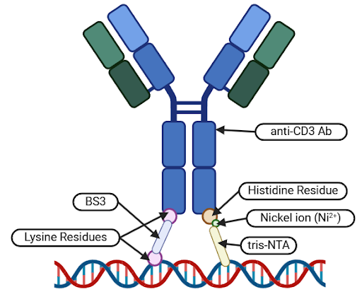
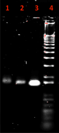

import ReferenceList from "@/components/ReferenceList.astro";

A key component in the AND box DNA origami carrier design is the anti-CD3 antibody – the interface between our design and the T-cell receptor (TCR) complex. Along with the A10-3.2 aptamer, the DNA origami carrier and the anti-CD3 antibody help to form a synthetic immunological synapse between CD4+ T-helper (Th) cells and prostate cancer (PC) cells, leading to the recruitment of CD8+ cytotoxic T-lymphocytes (CTLs).

In order for this synthetic immunological synapse to form, the anti-CD3 antibody must be firmly attached, or “docked” into a designated pocket in the DNA origami carrier. Furthermore, the antibody must be docked with the correct orientation – with the fragment variable (Fv) domains pointing out of the box, and with the fragment crystallizable (Fc) domain bound to the DNA origami carrier. This is to prevent antibody docking with random orientations, since binding of the Fv domain to the DNA carrier would limit interactions between the antibody and the target antigen (Anderson, 2009; Ouyang et. al., 2017).

As such, the aim of this protocol is to dock the anti-CD3 antibody with correct orientation inside its designated pocket within the DNA origami carrier.

## Reagents

| Reagent Name                                                     | Supplier                | Catalog Number |
| ---------------------------------------------------------------- | ----------------------- | -------------- |
| NiCl2                                                            | ThermoFisher Scientific | A14366.30      |
| CD3 Monoclonal Antibody (OKT3), Alexa Fluor™ 700, eBioscience™ | ThermoFisher Scientific | 56-0037-42     |
| BS3 (bis(sulfosuccinimidyl)suberate)                             | ThermoFisher Scientific | 21580          |
| $$\text{Mg(OAc)}_2$$                                             | ThermoFisher Scientific | J60041.AE      |
| EDTA (0.5 M), pH 8.0, RNase-free                                 | ThermoFisher Scientific | AM9260G        |

## Docking Mechanism

The antibody docking procedure will take place in three stages to ensure the formation of a secure linkage between the antibody and the DNA origami carrier.

**Stage 1:** Ni-NTA Non-covalent Bond Formation. The first stage will involve the formation of a temporary non-covalent bond between histidine residues on the Fc region of the antibody and tris-Nitrilotriacetic Acid (tris-NTA) functionalized staple strands within the DNA origami carrier pocket.

**Stage 2:** BS3 Covalent Bond Formation. The second stage will be mediated by a bifunctional bis(sulfosuccinimidyl) suberate (BS3) cross-linker, which will connect lysine residues on the Fc region of the antibody to 3’-amino-modified staple strands within the DNA origami carrier pocket. This will result in the formation of a permanent covalent bond between the anti-CD3 antibody and the DNA origami carrier.

**Stage 3:** EDTA-mediated Non-covalent Bond Removal. Lastly, ethylenediaminetetraacetic acid (EDTA) will be used as a chelating agent to remove the nickel ions from the non-covalent bonds formed in Stage 1, disrupting the non-covalent bond and leaving behind the BS3-mediated covalent bond (Ouyang et. al., 2017).

    |                                                                                                                           
 
                                                                                                                            |
    | :-------------------------------------------------------------------------------------------------------------------------------------------------------------------------------------------------------------------------------------------------------------------------------------------------------------------------------------------------: |
    | **_Figure 1:_** _Diagram depicting the non-covalent (right) and covalent (left) binding mechanisms that will be used to dock the Fc region of the anti-CD3 antibody to modified staple strands in the pocket of the DNA origami carrier._ |

Following these three stages, newly-formed BS3-mediated covalent bonds will ensure that the anti-CD3 antibody is securely attached to the DNA origami carrier, maintaining the correct orientation by anchoring the antibody’s Fc region to the bottom of the DNA carrier pocket.

## Methods

Due to resource limitations, Stages 1 and 3 were omitted from the conducted protocols. Instead, literature reports that the execution of Stage 2 alone could result in the successful docking of the anti-CD3 antibody – albeit with a lower yield (Ouayng et. al., 2017).

To begin formation of the BS3-mediated covalent bond, BS3 was added to a solution of DNA origami carriers at a ratio of 100:1 (BS3:carrier) such that the total volume was less than 500 μL. The solution was incubated at room temperature for 30 minutes before being transferred into a Microcon centrifugal filter unit (CFU) (100 kDa MWCO). The solution was then centrifuged three times at 9000 g for 6 mins to purify the sample and to remove excess BS3. Flow-through fluids were discarded between centrifugation procedures.

A dilution of anti-CD3 antibody stock solution was prepared by adding HEPES buffer (10 mM, pH 7.4) containing 12.5 nM magnesium acetate ($$\text{Mg(OAc)}_2$$) such that the final antibody stock solution concentration was between 30 and 45 μg/mL. 6 μL of the prepared diluted anti-CD3 antibody stock solution was added to 9 μL of the DNA carrier solution. The solution was mixed well and incubated at room temperature overnight (>8 hrs).

Following incubation, EDTA solution was added to the mixture until a concentration of 2.5 mM was reached, helping to remove any non-covalent conjugates (Ouyang et. al., 2017).

To validate the anti-CD3 antibody docking procedure, gel electrophoresis trials were conducted. Gels were composed of 1% agarose with 1X TAE buffer. The Froggabio 1 kb DNA Ladder was used as an experimental control to monitor the size and molecular weight of the resultant products. To prevent degradation of the anti-CD3 antibody, electrophoresis apparatuses were placed in a 4oC fridge and set to run for 150 minutes at 80 V.

## Expected Results

If the anti-CD3 antibody was successfully docked into the DNA origami carrier with the correct orientation, we would expect to see the DNA origami carrier with the antibody to be slightly larger and thus undergo less migration on an agarose gel. This is because the addition of an antibody would increase the molecular weight of the DNA origami carrier, making the structure move through the gel more slowly. This is reflected in the agarose gel performed by Ouyang et. al. (2017), as shown in Figure 2.

    |                                                                                                                           
 
                                                                                                                            |
    | :-------------------------------------------------------------------------------------------------------------------------------------------------------------------------------------------------------------------------------------------------------------------------------------------------------------------------------------------------: |
    | **_Figure 2:_** _Expected results of an agarose gel with successful antibody docking taken from Ouyang et al. (2017), with lane 1 being the antibody with the DNA origami structure, lane 2 being the DNA origami structure, lane 3 being the scaffold genome used to create the DNA origami structure, and lane 4 being a 1000 bp DNA ladder._ |

If the anti-CD3 antibody is unsuccessful in docking into the DNA origami carrier, we would expect the lane with the antibody and the DNA origami carrier to have a band at the same size as the lane with only the DNA origami carrier.

Further imaging with transmission electron microscopy would then be needed to confirm the successful docking of the anti-CD3 antibody in the correct orientation.

## References

<ReferenceList>

    Andersen, E. S., Dong, M., Nielsen, M. M., Jahn, K., Subramani, R., Mamdouh, W., Golas, M. M., Sander, B., Stark, H., Oliveira, C. L. P., Pedersen, J. S., Birkedal, V., Besenbacher, F., Gothelf, K. V., & Kjems, J. (2009). Self-assembly of a nanoscale DNA box with a controllable lid. Nature, 459(7243), 73–76. https://doi.org/10.1038/nature07971
    Ouyang, X., De Stefano, M., Krissanaprasit, A., Bank Kodal, A. L., Bech Rosen, C., Liu, T., Helmig, S., Fan, C., & Gothelf, K. V. (2017). Docking of antibodies into the cavities of DNA origami structures. Angewandte Chemie, 56(46), 14423-14427. https://doi.org/10.1002/ange.201706765

</ReferenceList>
