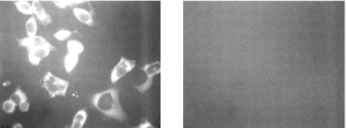

import ReferenceList from "@/components/ReferenceList.astro";

The purpose of this experiment is to evaluate the binding specificity of the RNA aptamer, A10-3.2, to PSMA, which is a key receptor of interest on prostate cancer cell line LNCaP (Lupold et al., 2002). A10-3.2 aptamer is a biotin-conjugated sequence which is known for its high affinity binding to PSMA. To evaluate its specificity, we are using a scrambled version of the aptamer, A10-3-rndm, as a negative control, which has a randomized sequence with no specific affinity to PSMA. The samples will be stained by streptavidin-Alexa Fluor 488 and fluorescence microscopy will be leveraged to visualize and quantify aptamer binding. DAPI staining of cell nuclei is used to ensure that any fluorescent signals detected are due to specific aptamer binding and not additional cells in each sample.

**Aim:** To determine if the DNA box with the A10-3.2 aptamers attached will bind to LNCaP cells.

## Techniques

### Fluorescence microscopy

Fluorescence microscopy is a revolutionary tool used to observe cellular, subcellular and molecular components (Lichtman & Conchello, 2005). Fluorophores are used to label specific target structures on cells, and have certain excitation and emission wavelengths for visualization. We will specifically be using Alexa Fluor 488, which is a green-fluorescent dye that can be conjugated to antibodies, peptides, and proteins and is ideal for cellular labeling. Within a fluorescent microscope, a mercury or xenon high-pressure bulb, with custom optical filters, emits required wavelengths to illuminate a sample and excite any fluorophore it contains (Sanderson et al., 2014). In our case, fluorescence microscopy will be leveraged to detect the specific binding of the A10-3.2 aptamer to the PSMA receptor, and we expect to visualize the green emission of Alexa Fluor 488.

## Reagents

| Reagent Name                   | Supplier                    | Catalog Number |
| ------------------------------ | --------------------------- | -------------- |
| LNCaP Cell Line                | BC Cancer Research Center   | n/a            |
| Trypan Blue Stain              | ThermoFisher Scientific     | T10282         |
| PBS                            | ThermoFisher Scientific     | 0010049        |
| Formaldehyde                   | ThermoFisher Scientific     | 28908          |
| A10-3.2 aptamer                | Integrated DNA Technologies | n/a            |
| A10-3.2 rndm scrambled aptamer | Integrated DNA Technologies | n/a            |
| Streptavidin-Alexa Fluor 488   | ThermoFisher Scientific     | S11223         |
| 2% Bovine Serum Albumin (BSA)  | MilliporeSigma              | A9576-50ML     |
| DAPI                           | ThermoFisher Scientific     | 62248          |

## Methods

Parts of the following protocol reference Lupold et al. (2002). First, the cell concentration (cells/mL) of the LNCaP cell line is determined using a hemocytometer. A cell suspension is created by suspending 50 µL of cells in 50 µL of trypan blue. Then, 10 µL of this suspension is added to the hemocytometer, and the cells within the four corner quadrants of the grid are counted using a phase-contrast microscope and clicker counter. The cell concentration is determined and further diluted to a concentration of 5 x 104 cells/mL using PBS. The cells are plated on four-chamber glass slides (for four conditions: one positive signal and three negative controls) by adding 1 mL of the diluted cells to each chamber and storing them in a 37°C, 5% CO₂ incubator for 24 hours.

Afterward, the media is removed, and the cells are washed twice with PBS and fixed using 3 mL of 10% formaldehyde (9 mL PBS + 1 mL formaldehyde) for 8-16 hours at room temperature. The formaldehyde is then removed, and the cells are rinsed twice with PBS. Aluminum foil is prepared to prevent light exposure to the cells, and each chamber is treated as follows: a drop of 50 nM A10-3.2 aptamer is added to chamber 1, a drop of 50 nM A10-3.2 scrambled aptamer is added to chamber 2, and no aptamers are added to chambers 3 and 4. After 10-15 minutes, the cells are washed twice with PBS, and chambers 1-3 are incubated with 200 µL of 10 µg/mL streptavidin-Alexa Fluor 488 in 1% BSA (10 mL PBS + 0.1 g BSA) for 5 minutes. The streptavidin-Alexa Fluor 488 is prepared by adding 6 µL of streptavidin conjugate to 594 µL of 1% BSA and centrifuging it at 14,000 g for 5 minutes before use. The cells are then washed twice with PBS to remove free streptavidin, and 1 mL of DAPI stain, prepared by adding 4 µL of DAPI to 3996 µL of 1% BSA, is added to all four chambers for 2-3 minutes. The cells are then rinsed in PBS for 5 minutes on a platform shaker to remove excess stains. Finally, the slides are detached from the chamber, coverslipped, and imaged using a Zeiss Axioscope fluorescence microscope.

## Expected Results

We expect DAPI to localize in the nuclei of cells in all four chambers, resulting in nuclear fluorescence across the slides. For the Alexa Fluor 488 (AF-488) signal, we anticipate fluorescence in chamber 1, where the A10-3.2 aptamer should bind to the cells and enable AF-488 attachment through streptavidin-biotin interactions. In contrast, chambers 2 through 4 should show minimal or no AF-488 fluorescence due to the absence of specific aptamer binding in these controls (see Figure 1). Importantly, AF-488 signals should be co-localized to DAPI signals, thereby validating that any fluorescent signals observed are specific to cells, not background signal. Given more time, another cell line (e.g., PC3) without PSMA expression would also be tested as a negative control to further validate the binding specificity with PSMA.

|                                                                                    
 
                                                                                     |
| :--------------------------------------------------------------------------------------------------------------------------------------------------------------------------------------------------------------------------------------------------------------------------------: |
| **_Figure 1:_** _Adapted from Lupold et al. (2002). Left: Expected results for chamber 1 with the correct aptamer for validating binding specificity between the DNA origami box and LNCaP cells expressing PSMA. Right: Expected results for chamber 2-4, the negative controls._ |

## References

<ReferenceList>

Lefevre, C., Kang, H. C., Haugland, R. P., Malekzadeh, N., Arttamangkul, S., & Haugland, R. P. (1996). Texas Res-X and rhodamine Red-X, new derivatives of sulforhodamine 101 and lissamine rhodamine B with improved labeling and fluorescence properties. Bioconjugate Chemistry, 7(4), 482–489. https://doi.org/10.1021/bc960034p
Lichtman, J. W., & Conchello, J.-A. (2005). Fluorescence microscopy. Nature Methods, 2(12), 910–919. https://doi.org/10.1038/nmeth817
Lupold, S. E., Hicke, B. J., Lin, Y., & Coffey, D. S. (2002). Identification and Characterization of Nuclease-stabilized RNA Molecules That Bind Human Prostate Cancer Cells via the Prostate-specific Membrane Antigen1. Cancer Research, 62(14), 4029–4033.
Sanderson, M. J., Smith, I., Parker, I., & Bootman, M. D. (2014). Fluorescence Microscopy. Cold Spring Harbor Protocols, 2014(10), pdb.top071795. https://doi.org/10.1101/pdb.top071795

</ReferenceList>
