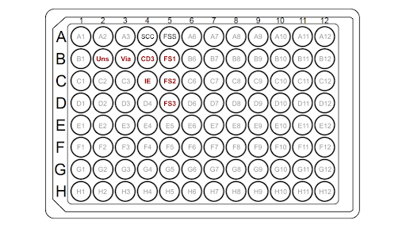

import ReferenceList from "@/components/ReferenceList.astro";

Evaluating the binding affinity and target specificity of the DNA nanostructure box containing the antibody is critical to validating its therapeutic potential. The purpose of this experiment is to confirm that the antibody contained in the box binds to a CD3 T-cell receptor by using flow cytometry. With flow cytometry, a double staining technique will be leveraged, wherein a fluorophore will be conjugated to an anti-CD3 antibody to stain the CD3 receptors on T-cells and a second fluorophore will be conjugated to the antibody contained in the box. Fluorescent signals detected simultaneously from both fluorophores will be indicative of successful binding of the antibody inside the box to the T-cell receptor.

**Aim:** To assess the binding affinity and target specificity of the anti-CD3 antibody enclosed in the box in binding to T cells.

## Techniques

Flow cytometry is a powerful technique used to rapidly analyse the characteristics of single cells quantitatively and qualitatively (McKinnon, 2018). It involves first conjugating fluorophores to the individual populations we are trying to observe. In this case, we are conjugating a fluorophore to an anti-CD3 antibody and a second fluorophore to the antibody inside the box. While cells are suspended in a buffered salt solution, they are then passed in a continuous fluid stream through multiple lasers which produces visible light scatter and fluorescent emission (McKinnon, 2018). The cells are each counted and analysed by photomultiplier and photodiode detectors, and this data is converted into electronic signals that are analysed to characterize various cell populations (McKinnon, 2018). This enables individual samples to be isolated based on their fluorescent properties. We expect to observe simultaneous fluorescence from both the CD3 receptor on the T cells and the antibody inside the box, which will indicate the binding affinity of the antibody.

## Reagents

| Reagent Name                                                        | Supplier                | Catalogue Number |
| ------------------------------------------------------------------- | ----------------------- | ---------------- |
| eBioscience™ Immune Response T Cell Activation Induced Markers Kit | ThermoFisher Scientific | A53424           |

## Methods

### Preparing T cells

The T-cells are first prepared using a protocol adapted from Thermo-Fisher for 96 well plates. The T-cells are resuspended at $$2 \times 10^7$$ cells/mL in 0.025% Trypsin, 0.01% EDTA, and PBS in a microcentrifuge tube. In a separate tube, purified antibody-box solution is added to attain a 5 nM concentration of antibodies in cell media. All cell mixtures are incubated at 4°C for 30 mins, and then harvested by centrifugation at 200g for 3 mins and thoroughly washed 3 times with PBS/0.5% gelatin. In the 96-well plate, 50 µL of cells (~$$1 \times 10^6$$) per well are added except for the single color compensation control (SCC) wells according to the sample plate layout.

|                                                                                                                      
 
                                                                                                                      |
| :-------------------------------------------------------------------------------------------------------------------------------------------------------------------------------------------------------------------------------------------------------------------------------------------------------------------------------------------------------: |
| **_Figure 1:_** _A schematic of a sample plate layout, where the B2 well contains T cells only (unstained), the B3 well contains T cells and viability dye, the B4 well contains beads and anti-CD3 (SCC antibody), the C4 well represents beads and antibody(SCC antibody), and the B5 to D5 wells contain fully-stained samples (+ anti-CD3 antibody)._ |

### Stain cells with viability dye

The Anti-C3 Antibody-T cell Validation Assay was adapted from the standard protocol from the eBioscience Immune Response T Cell Activation Induced Markers Kit (ThermoFisher Scientific, 2022). A stock solution of LIVE/DEADTM Fixable Near IR (780) is prepared by thawing DMSO and one vial of lyophilized dye, and then adding and mixing 50 µL of DMSO to one vial of dye. A 2X working solution of LIVE/DEADTM Fixable Near IR (780) is prepared by adding 2µL of the stock solution per 1 mL of PBS (azide-free), with the same volume as the T cell suspension prepared. The cells were removed from the incubator and 100 µL of 2X LIVE/DEADTM Fixable Near IR (780) was added and mixed well in Via and FSS wells. The cells are incubated for 10-30 minutes at room temperature and centrifuged at 2000 RPM for 5 minutes. The supernatant is discarded and the cells are resuspended by gentle pipetting in the residual buffer volume remaining in the wells.

### Fix Cells

To fix and prepare the cells for flow cytometry, 100 µL of IC Fixation Buffer is added to the cells and incubated for 20-60 minutes at room temperature. The cells are centrifuged at 2000 RPM for 5 minutes. The supernatant is discarded and the cells are resuspended in the residual buffer. 250 µL of Flow Cytometry Staining Buffer is added and centrifuged, and the supernatant is discarded and cells are resuspended in the residual buffer volume remaining in wells. 250 µL of Flow Cytometry Staining Buffer is added once more and centrifuged, and the supernatant is discarded and the cells are resuspended in 70 µL of Flow Cytometry Staining Buffer. One well is set aside as the single color compensation control for the LIVE/DEADTM Fixable Near IR (780) before antibody staining.

### Stain cells and compensation beads with fluorophore conjugated antibodies

The fully-stained samples are prepared by adding 5 µL of CD3 Monoclonal Antibody (SK7), eFluor 450, eBioscience to each of the main sample wells and gently pipetting to mix well. The single color compensation controls (SCC) are prepared by vigorously inverting at least 10 times or pulse vortexing and then aliquoting one drop into each of two wells. The appropriate antibody is added according to the following table:

    | Well no. | Condition/Samples Added | Volume to add |
    | ------------- | ----------- | ------ |
    | B4 *in sample plate layout | eFluor 450 | 5 µL |
    | C4 *in sample plate layout | Anti-CD3 Antibody, Alexa Fluor 700 | 5 µL |

    | |
    | :---: |
    | **_Table 1._** _Volumes and conditions needed for sample preparation._ |

150 µL of Flow Cytometry Staining buffer is added to all wells (cells and beads) and centrifuged. The supernatant is discarded and the cells and beads are resuspended in the residual volume of the buffer. These steps are repeated twice with 150 µL of Flow Cytometry Staining Buffer, and again with 200 - 250 µL of Flow Cytometry Staining Buffer. Then store at 4°C and protect from light until ready to analyse on a flow cytometer. Data is then collected by the flow cytometer.

## Expected Results

In this experiment, we would have two main conditions:

1. A positive control: T cells sample with the externally added anti-CD3 antibody
1. Treatment: T cells sample with the added DNA box's anti-CD3 antibody

Although the antibodies are identical, in the first scenario, the antibody is applied independently, whereas in the second, it is incorporated within the DNA box structure. We anticipate observing differences in marker expression, as antibody binding to the cell surface is expected to be more efficient without the additional structural component of the DNA box.

With this experiment, the positive signal would confirm that the anti-CD3 antibody in the DNA box has specifically attached to the T-cell CD3 receptors, verifying target specificity and binding affinity.

Flow cytometry data should show:

1. **Fluorescent Signal from the External Anti-CD3 Antibody:** This will confirm that CD3 receptors on the T-cells are successfully tagged with the conjugated antibody, serving as an indicator of CD3 receptor presence.

1. **Fluorescent Signal from the Anti-CD3 Antibody in the DNA Box:** This second signal will demonstrate that the DNA box itself is capable of targeting and binding to the T-cell CD3 receptors.

For positive confirmation, the control should display nearly 100% marker expression, as all cells undergoing flow cytometry are sorted T-cells (CD3⁺). For the treatment to be considered effective, we would expect a marker expression threshold 50%. In the treatment group, the antibody is contained within the DNA box, which may reduce accessibility and binding efficiency. By setting a 50% threshold, we account for this potentially reduced activation capacity while still ensuring that a significant portion of T-cells are engaged. This threshold thus provides a balance between expected activation efficiency and practical therapeutic relevance, indicating that the DNA box achieves sufficient T-cell targeting and activation to be considered effective.

## References

<ReferenceList>

eBioscience Immune Response T Cell Activation Induced Markers Kit User Guide. ThermoFisher Scientific (2022). https://www.thermofisher.com/document-connect/document-connect.html?url=https://assets.thermofisher.com/TFS-Assets%2FLSG%2Fmanuals%2FMAN0026420_2162763_eBioIRTCellActIndMark_UG.pdf.  
McKinnon, K. M. (2018). Flow Cytometry: An Overview. Current Protocols in Immunology, 120(1). https://doi.org/10.1002/cpim.40

</ReferenceList>
