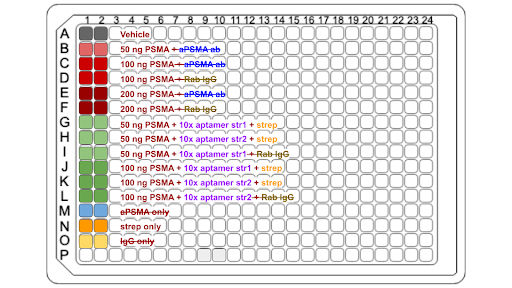
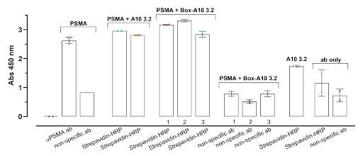

import ReferenceList from "@/components/ReferenceList.astro";

In 1990, scientists Andy Ellington and Jack Szostak conducted the first set of experiments that would eventually lead to the development of RNA “aptamers” – strands of RNA that can bind to biological molecules with high specificity and affinity (Schroeder, 2015). These RNA strands can fold into specific three-dimensional structures depending on their nucleotide sequences, allowing them to form unique conformers suited to the many types of binding pockets found on common proteins. In our design, we used the A10-3.2 RNA aptamer to ensure that our box specifically binds to prostate-specific membrane antigens (PSMA), which are overexpressed in prostate cancer cells.

As such, the aim of this experiment is to validate that the A10-3.2 aptamer binds to PSMA, both free-floating in solution, and while attached to the box. To achieve this aim, an enzyme linked immunosorbent high binding assay (ELISA) was performed (Thermo Fisher Scientific, n.d.). In this, the target molecule is immobilized onto a plate surface before the secondary molecule is added and allowed to bind. Then, a tagged antibody is added to bind to the secondary molecule, which is an indication of a successful pairing and used as a target for color-changing substrates. The intensity of color resulting from these added substrates can be read with a plate reader and used to generally quantify the number of aptamer-receptor pairs.

## Reagents

| Reagent Name                               | Supplier                    | Catalog Number |
| ------------------------------------------ | --------------------------- | -------------- |
| PSMA                                       | SinoBiological              | 15877-H07H-B   |
| Tween 20 washing buffer, 0.5% in PBS (10X) | ThermoFisher Scientific     | J63596.AP      |
| 2% Bovine Serum Albumin (BSA)              | MilliporeSigma              | A9576-50ML     |
| Dulbecco’s Phosphate Buffered Saline       | Corning                     | 21-031-CM      |
| ɑPSMA conjugated antibody                  | Cell Signaling              | 12702          |
| Streptavidin-HRP                           | ThermoFisher Scientific     | N100           |
| 1X TMB Working Substrate Solution          | VWR                         | 95059-154      |
| TMB (X1) Stop Solution                     | VWR                         | 95059-200      |
| A10-3.2 biotinylated aptamers              | Integrated DNA Technologies | n/a            |

## Methods

PSMA receptors were diluted using phosphate-buffered saline (PBS), of which various concentrations were used to find the optimal dilution for the experiment. 50 µl of the PSMA solution was then used to coat each well of a 96-well plate, which was sealed and incubated overnight on a shaking platform in a 4°C walk-in fridge. The solution was then removed and the wells washed using Tris-buffered saline with Tween 20 washing buffer (TBST) in order to remove unbound receptors. Blocking was also performed using 100 µl of block buffer (1X wash buffer + 2% Bovine Serum Albumin) per well in order to ensure that all open spaces on the plate surface were covered and unable to be occupied by unwanted molecules. After incubation at room temperature for an hour, as well as three more washes, the plate was ready for the addition of the secondary binding molecule.

50 µl of diluted A10-3.2 biotinylated aptamers was added to each well, incubated for an hour at room temperature, and washed several times to remove unbound aptamers. Then, 50 µl of diluted streptavidin tagged with horseradish peroxidase (HRP) was added to each well and allowed to bind to the biotin on the aptamers, and kept for 2-3 hours on a shaking platform at room temperature. After removal of the detection antibody solution, 50 µl of 3,3′,5,5′-Tetramethylbenzidine (TMB) was added to each well, and the plate was allowed to incubate in the dark for 15 minutes or until the control groups turned blue. TMB undergoes a redox reaction with the HRP tags on the aptamers in order to produce the color change (Antibodies Incorporated, n.d.), thus the change observed in the experimental groups was an indication that binding was successful. At this point, 1M of hydrochloric acid was added per well to stop the reaction, turning the solution yellow. Finally, a plate reader on the colorimetric setting at 450 nm was used to measure the intensity of the yellow color, reflecting a general quantification of the amount of aptamer-receptor bonded pairs.

This experiment was conducted first with free-floating aptamers and then with box-bonded aptamers to ensure that the integrity of binding is maintained even when attached to the DNA origami box.

## Results and Discussion

    |                                                                                                                           
 
                                                                                                                            |
    | :-------------------------------------------------------------------------------------------------------------------------------------------------------------------------------------------------------------------------------------------------------------------------------------------------------------------------------------------------: |
    | **_Figure 1:_** _Plate Setup for ELISA 1_ |

The first ELISA was performed with conditions as shown in Figure 1. Various concentrations of PSMA (50 ng, 100 ng, 200 ng) were tested to determine optimal conditions for binding. Two variations of the aptamers were also tested separately for binding to PSMA to ensure that both aptamers bind to PSMA with sufficient affinity. This condition was assessed because the aptamer sequences are antiparallel – a property that could potentially affect the resultant RNA tertiary structures. Control conditions originally included PSMA with aPSMA antibody, but due to various complications encountered at the time of the experiment, this reagent was unable to be obtained and the assay was run without it.

    |                                                                                                                           
 
                                                                                                                            |
    | :-------------------------------------------------------------------------------------------------------------------------------------------------------------------------------------------------------------------------------------------------------------------------------------------------------------------------------------------------: |
    | **_Figure 2:_** _ELISA 1 Color Intensity Results_ |

50 ng PSMA resulted in equal color intensity to 100 ng, indicating that full saturation is already being achieved at 50 ng. This concentration was used in further experiments. Intensity for aptamer strands 1 and 2 are also both equal in intensity, indicating there is no significant difference in its binding capability to PSMA.

The main issue encountered is that Streptavidin-HRP on its own showed nearly the same amount of intensity as PSMA binded to aptamer and Strep. This makes it unclear whether the high intensity of the PSMA-aptamer conditions are due to actual binding or the presence of strep-HRP. Further testing is required.

    |                                                                                                                           
 
                                                                                                                            |
    | :-------------------------------------------------------------------------------------------------------------------------------------------------------------------------------------------------------------------------------------------------------------------------------------------------------------------------------------------------: |
    | **_Figure 3:_** _Plate Setup for ELISA 2_ |

The second ELISA was performed with 50 ng PSMA across the board. Binding affinity was tested with both versions of aptamer as well as with various versions of the formed box. PSMA with aPSMA antibody was used as a specific positive binding control while Rabbit IgG was used for a negative binding control due its more general binding ability. Both Rabbit IgG and streptavidin are tagged with HRP.

    |                                                                                                                           
 
                                                                                                                            |
    | :-------------------------------------------------------------------------------------------------------------------------------------------------------------------------------------------------------------------------------------------------------------------------------------------------------------------------------------------------: |
    | **_Figure 4:_** _ELISA 2 Color Intensity Results_ |

Streptavidin-HRP on its own has a much lower intensity than the condition groups, which is an improvement from the first ELISA and helps validate that binding is properly represented by a high intensity readout. This was achieved by lowering the concentration of TMP used in the ELISA protocol, allowing for a better visualization of differences in absorbance. PSMA binding to both versions of aptamer are of equal intensity, confirming that both strands have equal affinity to PSMA. All three PSMA-box pairings show high intensity with Strep but a low intensity with Rab IgG, which is affirmative in showing that the box outcompetes the Rab IgG for binding sites on the PSMA.

However, there are issues that arise due to the fact that PSMA is also biotinylated when it shouldn’t be. There are noticeable differences between the replicates of PSMA binding to aptamer with Strep, which may be due to the fact that the biotinylated PSMA opens another site for Strep to bind, leading to non-specific binding of the Strep-HRP. This is further proven by the fairly high intensity seen in the PSMA-Strep condition. Further experiments are required in order to ensure that Strep is binding onto the proper site.

Another issue is seen with the fact that the PSMA-aptamer-Rab IgG condition has equal intensity to PSMA-aptamer-Strep, which may also be due to unspecific binding of Rab IgG. It is possible that the aptamers are not able to compete for binding space as effectively as the box can.

## References

<ReferenceList>

    Antibodies Incorporated. (n.d.). HRP Redox Reaction Driven TMB Color Development. https://www.antibodiesinc.com/pages/hrp-redox-reaction-driven-tmb-color-development
    Schroeder R. (2015). Soups & SELEX for the origin of life. RNA (New York, N.Y.), 21(4), 729–732. https://doi.org/10.1261/rna.050559.115
    Thermo Fisher Scientific. (n.d.). Overview of ELISA. https://www.thermofisher.com/ca/en/home/life-science/protein-biology/protein-biology-learning-center/protein-biology-resource-library/pierce-protein-methods/overview-elisa.html

</ReferenceList>
