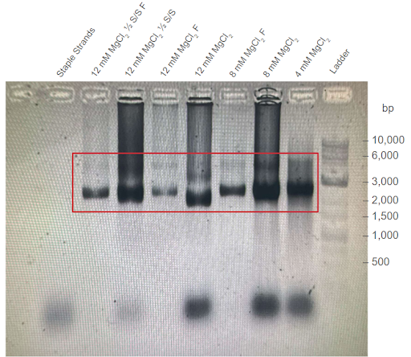
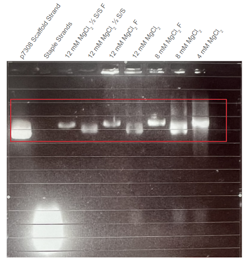
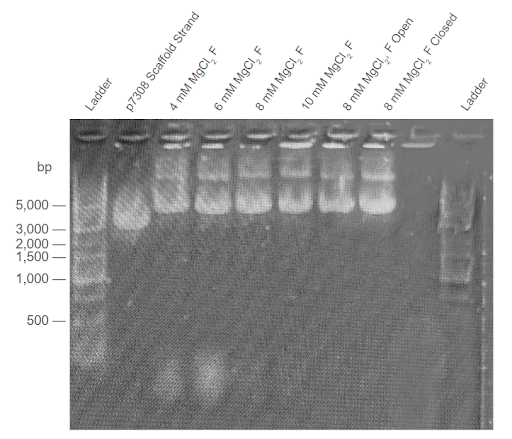
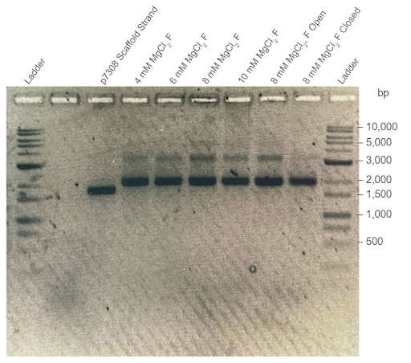
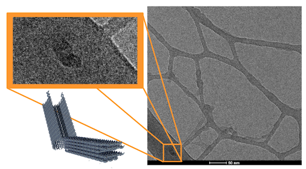
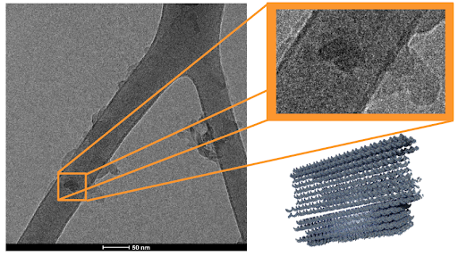
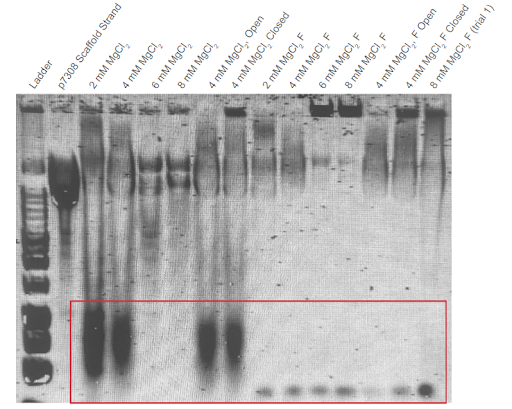
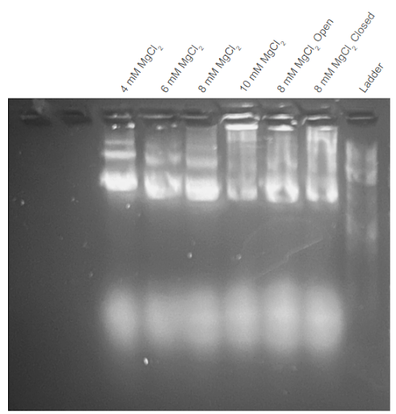

import ReferenceList from "@/components/ReferenceList.astro";
import { Aside } from "@astrojs/starlight/components";

DNA origami describes the process of annealing DNA in unique 2D or 3D conformations by applying calibrated, heating cycles to a solution of single-stranded DNA (ssDNA) (Hong et al., 2017). In this process, long loops of ssDNA, known as ‘scaffold’ strands, are incubated with shorter segments of modified ssDNA, known as ‘staple’ strands. These ‘staple’ strands anneal to specific segments of the ‘scaffold’ strand, guiding and forming unique structures that can be applied in a wide range of settings (Hong et al., 2017).

The aim of this protocol is to form the computationally predicted structure of the AND box DNA origami carrier. This carrier will act as a vessel for the anti-CD3 antibody. The carrier will remain closed until the vessel comes into contact with prostate-specific membrane antigen (PSMA) on a prostate cancer cell surface. Upon contact, the vessel will open, exposing the anti-CD3 antibody and enabling binding to CD4+ T-helper (Th) cells and to CD8+ cytotoxic T-lymphocytes (CTL)

<Aside type="note" title="Abbreviations used">

- TBS - Tris Buffered Saline
- EDTA - Ethylenediaminetetraacetic acid
- bp - Base Pairs

</Aside>

## Techniques

### Thermal Annealing of DNA origami

As mentioned above, DNA origami involves the annealing of a scaffold strand and many short staple strands. In order to ensure correct placement of each staple strand, the DNA strands need to be heated in a specific, cyclic heating pattern. Typically, this heating pattern involves two phases - denaturing and annealing (AAT Bioquest, 2023). The denaturing step involves high heat (90-95oC), which ensures total separation of the scaffold strand from the staple strands, since the DNA would be subjected to temperatures that are higher than the DNA melting temperature. The following annealing phase involves lower heat (50-56oC), which allows the staple strands to bond with the scaffold strand.

### Gel Electrophoresis

Gel electrophoresis is an experimentation method commonly used to validate the size, length, and conformation of DNA strands and proteins (Lee, 2012). This is accomplished by pipetting DNA or protein samples into wells in a gel substrate, which is typically composed of either agarose or polyacrylamide. Since DNA is a negatively charged molecule, a voltage can be applied across the gel substrate, causing the DNA to migrate across the porous matrix of the gel along with the electrical gradient. However, since the porosity of the gel provides some resistance to the movement of the DNA molecules, larger DNA molecules or molecules with more complex tertiary/quaternary structures migrate across the gel at a slower speed compared to smaller/unfolded DNA molecules. By comparing the amount of movement of DNA samples to a standard DNA ladder, gel electrophoresis is able to verify the size and molecular weight (MW) of strands in the DNA sample (Lee, 2012). For this experiment, an agarose gel electrophoresis will be used to ensure that the DNA origami carrier has formed to approximately the correct dimensions.

### Cryogenic Electron Microscopy

Similar to other forms of electron microscopy, Cryogenic Electron Microscopy (Cryo-EM) is a microscopy method that captures images by firing a stream of electrons at a sample and detecting where the electrons deflect (Peplow, 2017). Cryo-EM uses extremely cold temperatures (~ -183 °C) to form vitreous ice around molecules in the sample, minimizing molecular vibrations and preventing molecular degradation during the image capture process (Wu et. al., 2021). For Cryo-EM, samples are typically immobilized on carbon-copper networks that are referred to as “grids”.

## Reagents

| Reagent Name                   | Supplier                    | Catalogue Number |
| ------------------------------ | --------------------------- | ---------------- |
| p7308 scaffold strand          | Tilibit Nanosystems         | n/a              |
| Staple strands                 | Integrated DNA Technologies | n/a              |
| Removal strands                | Integrated DNA Technologies | n/a              |
| Tris-EDTA (TE) buffer          | Integrated DNA Technologies | n/a              |
| Magnesium chloride             | ThermoFisher Scientific     | AM9530G          |
| Agarose A                      | BioBasic                    | D0012            |
| Tris-acetate-EDTA (TAE) buffer | ThermoFisher Scientific     | B49              |
| SYBR Safe DNA gel stain        | ThermoFisher Scientific     | S33102           |
| DNA Gel Loading Dye (6X)       | ThermoFisher Scientific     | R0611            |
| 1 kb Plus DNA Ladder           | FroggaBio                   | DM015-R500       |

## Methods

To construct the DNA origami carrier, a mastermix containing our custom p7308 scaffold strand, 203 staple strands, guide staple strands, Tris-EDTA (TE) buffer, magnesium chloride, and deionized water was prepared. Specific volumes are denoted in Appendix 1.

To demonstrate the different conformers of the DNA origami carrier, we designed testing conditions to anneal a carrier in its closed conformer, open conformer, and with and without a docked antibody.

Once the components of the Mastermix were combined, the 1 mL Mastermix tube was placed in a thermal cycler, and an annealing program (specified in Table 1) was executed.

    <table style="border-collapse: collapse">
        <thead>
            <tr>
                <th colspan="3" style="border: 1px solid black; padding: 8px; text-align: left;">Cycle 1:</th>
            </tr>
            <tr>
                <th style="border: 1px solid black; padding: 8px;">Step</th>
                <th style="border: 1px solid black; padding: 8px;">Temp (°C)</th>
                <th style="border: 1px solid black; padding: 8px;">Ramp Rate #1</th>
            </tr>
        </thead>
        <tbody>
            <tr>
                <td style="border: 1px solid black; padding: 8px;">1</td>
                <td style="border: 1px solid black; padding: 8px;">80</td>
                <td style="border: 1px solid black; padding: 8px;">Hold For 5 minutes</td>
            </tr>
            <tr>
                <td style="border: 1px solid black; padding: 8px;">2</td>
                <td style="border: 1px solid black; padding: 8px;">80</td>
                <td style="border: 1px solid black; padding: 8px;">2 min / °C</td>
            </tr>
            <tr>
                <td style="border: 1px solid black; padding: 8px;">3</td>
                <td style="border: 1px solid black; padding: 8px;">61</td>
                <td style="border: 1px solid black; padding: 8px;">150 min / °C</td>
            </tr>
            <tr>
                <td style="border: 1px solid black; padding: 8px;">4</td>
                <td style="border: 1px solid black; padding: 8px;">24</td>
                <td style="border: 1px solid black; padding: 8px;">Infinite Hold</td>
            </tr>
            <tr>
                <td style="border: 1px solid black; padding: 8px;">Run Time</td>
                <td colspan="2" style="border: 1px solid black; padding: 8px;">3 Days and 21 hours</td>
            </tr>
        </tbody>
    </table>

    | |
    |:--:|
    | ***Table 1:*** *Annealing program scheme for thermocycling of the Mastermix.* |

After the initial formation of the DNA origami carrier, a solution of removal strands is added to the Mastermix in a 10:1 excess, to facilitate the removal of the guide staple strands that are no longer needed. The samples are then incubated in a thermal cycler according to the annealing program specified in Tables 2a and 2b.

    <table style="border-collapse: collapse">
        <thead>
            <tr>
                <th colspan="3" style="border: 1px solid black; padding: 8px; text-align: left;">Cycle 1:</th>
            </tr>
            <tr>
                <th style="border: 1px solid black; padding: 8px;">Step</th>
                <th style="border: 1px solid black; padding: 8px;">Temp (°C)</th>
                <th style="border: 1px solid black; padding: 8px;">Ramp Rate #1</th>
            </tr>
        </thead>
        <tbody>
            <tr>
                <td style="border: 1px solid black; padding: 8px;">1</td>
                <td style="border: 1px solid black; padding: 8px;">30</td>
                <td style="border: 1px solid black; padding: 8px;">Hold for 25 minutes</td>
            </tr>
            <tr>
                <td style="border: 1px solid black; padding: 8px;">2</td>
                <td style="border: 1px solid black; padding: 8px;">30</td>
                <td style="border: 1px solid black; padding: 8px;">1 min / °C</td>
            </tr>
            <tr>
                <td style="border: 1px solid black; padding: 8px;">3</td>
                <td style="border: 1px solid black; padding: 8px;">24</td>
                <td style="border: 1px solid black; padding: 8px;">Infinite Hold</td>
            </tr>
            <tr>
                <td style="border: 1px solid black; padding: 8px;">Run Time</td>
                <td colspan="2" style="border: 1px solid black; padding: 8px;">31 minutes</td>
            </tr>
        </tbody>
    </table>

    | |
    |:--:|
    | ***Table 2a:*** *Annealing program for the first guide staple removal cycle.* |

    <table style="border-collapse: collapse">
        <thead>
            <tr>
                <th colspan="3" style="border: 1px solid black; padding: 8px; text-align: left;">Cycle 2:</th>
            </tr>
            <tr>
                <th style="border: 1px solid black; padding: 8px;">Step</th>
                <th style="border: 1px solid black; padding: 8px;">Temp (°C)</th>
                <th style="border: 1px solid black; padding: 8px;">Ramp Rate #1</th>
            </tr>
        </thead>
        <tbody>
            <tr>
                <td style="border: 1px solid black; padding: 8px;">1</td>
                <td style="border: 1px solid black; padding: 8px;">60</td>
                <td style="border: 1px solid black; padding: 8px;">Hold for 25 minutes</td>
            </tr>
            <tr>
                <td style="border: 1px solid black; padding: 8px;">2</td>
                <td style="border: 1px solid black; padding: 8px;">60</td>
                <td style="border: 1px solid black; padding: 8px;">1 min/ °C</td>
            </tr>
            <tr>
                <td style="border: 1px solid black; padding: 8px;">3</td>
                <td style="border: 1px solid black; padding: 8px;">24</td>
                <td style="border: 1px solid black; padding: 8px;">Infinite Hold</td>
            </tr>
            <tr>
                <td style="border: 1px solid black; padding: 8px;">Run Time</td>
                <td colspan="2" style="border: 1px solid black; padding: 8px;">61 minutes</td>
            </tr>
        </tbody>
    </table>

    | |
    |:--:|
    | ***Table 2b:*** *Annealing program for the second guide staple removal cycle.* |

To validate the correct formation of DNA origami carrier after thermal annealing, we visualized the structural conformation of the DNA nanostructures via Cryo-EM, as well as an agarose gel electrophoresis to verify the size of the generated products.

First, an agarose gel electrophoresis protocol was conducted to verify that the generated DNA structures from the thermoramp protocol had the correct size. Several experimental controls were established to help determine criteria for a correctly formed DNA carrier. Our positive experimental control was our p7308 scaffold strand, which had a comparable size and MW to our DNA carrier. This control served as a landmark for structures within a close range of our predicted DNA carrier dimensions. Another experimental control that was used to assess the size and MW of the DNA structures formed during thermoramp trials was the Froggabio 1 kb DNA Ladder. This DNA ladder played a similar role in helping to landmark structures that share similar physical properties to the predicted DNA carrier structure.

To help optimize the formation of our DNA origami carriers, varying concentrations of $$\text{MgCl}_2$$ between 4 mM and 12 mM were added to the Mastermix solutions. This is based on the findings of Douglas et. al (2012), who used a concentration of 8 mM $$\text{MgCl}_2$$ to form their DNA origami structures. Size and MW were assessed for DNA origami carriers in their closed and open conformers to validate the formation of the carrier in both conformers. Closed-conformer DNA carriers were formed by omitting removal strands from the Mastermix solution, while open-conformer DNA carriers were formed by omitting aptamer strands from the Mastermix solution.

Following the gel electrophoresis protocol, samples of the closed-conformer DNA carrier were used in a Cryo-EM trial to further verify the structures produced by the thermoramp protocol.

## Results

### Gel Electrophoresis Results

In total, four thermoramp trials and six agarose gel trials were conducted prior to Cryo-EM analysis. The most relevant agarose gel results are shown below, all other gels are included in Appendix 2. All gel samples shown below use the 1 kb DNA Ladder for reference.

|                                                                                                                                                                                                     
 
                                                                                                                                                                                                      |
| :----------------------------------------------------------------------------------------------------------------------------------------------------------------------------------------------------------------------------------------------------------------------------------------------------------------------------------------------------------------------------------------------------------------------------------------------------------------------------------------------------------------------------------: |
| **_Figure 1:_** _First agarose gel trial validating the first DNA carrier formation thermoramp trial. Electrophoresis was conducted on 1% agarose gel with 1X TAE buffer at 100V. F = Sample filtered in a centrifugal filter unit (CFU). ½ S/S = sample with ½ staple/strand concentration. Filtered condition removes excess removal strands from the DNA carrier sample. Conditions were conducted with different concentrations of $$\text{MgCl}_2$$. Red box outlines the potential location of correctly formed DNA carriers._ |

|                                                                                                                                                                       
 
                                                                                                                                                                        |
| :----------------------------------------------------------------------------------------------------------------------------------------------------------------------------------------------------------------------------------------------------------------------------------------------------------------------------------------------------------------------------------------------------------------------------------------------------------------------: |
| **_Figure 2:_** _Second agarose gel trial validating the first DNA carrier formation thermoramp trial. Electrophoresis was conducted on 1% agarose gel with 1X TAE buffer at 100V. F = Sample filtered in a CFU. ½ S/S = sample with ½ staple/strand concentration. Conditions were conducted with different concentrations of $$\text{MgCl}_2$$. Shown in the red box, gel results suggest that the DNA structures match the MW of the original p7308 scaffold strand._ |

|                                                                                                                                                           
 
                                                                                                                                                            |
| :----------------------------------------------------------------------------------------------------------------------------------------------------------------------------------------------------------------------------------------------------------------------------------------------------------------------------------------------------------------------------------------------------------------------------------------------: |
| **_Figure 3:_** _Second agarose gel trial validating the third DNA carrier formation thermoramp trial. Electrophoresis was conducted on 2% agarose gel with 1X TAE buffer at 100V. F = Sample filtered in a CFU. “Open” condition excludes the aptamers from the Mastermix solution. “Closed” condition excludes the removal strands from the Mastermix solution. Conditions were conducted with different concentrations of $$\text{MgCl}_2$$._ |

|                                                                                                                                                     
 
                                                                                                                                                      |
| :----------------------------------------------------------------------------------------------------------------------------------------------------------------------------------------------------------------------------------------------------------------------------------------------------------------------------------------------------------------------------------------------------------------------------------: |
| **_Figure 4:_** _Third agarose gel trial validating the third DNA carrier formation trial. Electrophoresis was conducted on 1% agarose gel with 1X TAE buffer at 100V. F = Sample filtered in a CFU. “Open” condition excludes the aptamers from the Mastermix solution. “Closed” condition excludes the removal strands from the Mastermix solution. Conditions were conducted with different concentrations of $$\text{MgCl}_2$$._ |

### Cryo-EM Results

To visually confirm the shape and size of the structures formed during our DNA carrier formation thermoramp trials, Cryo-EM images of our closed carrier samples were produced. These samples were taken from the third thermoramp trial, where the DNA carriers were made without removal strands and filtered with a CFU.

|                                                                                        
 
                                                                                        |
| :-------------------------------------------------------------------------------------------------------------------------------------------------------------------------------------------------------------------------------------------------------------------------------------------: |
| **_Figure 5:_** _(right) First Cryo-EM image of closed DNA carrier sample. The dark structure boxed in orange (top-left) resembles the predicted molecular structure of our DNA carrier in its open conformation. Simulation image of our DNA carrier (bottom-left) is shown for comparison._ |

|                                                                                          
 
                                                                                          |
| :-----------------------------------------------------------------------------------------------------------------------------------------------------------------------------------------------------------------------------------------------------------------------------------------------: |
| **_Figure 6:_** _(left) Second Cryo-EM image of closed DNA carrier sample. The dark structure boxed in orange (top-right) resembles the predicted molecular structure of our DNA carrier in its closed conformation. Simulation image of our DNA carrier (bottom-right) is shown for comparison._ |

## Discussion

In all four gel electrophoresis trials shown above, bands of DNA with a similar position to the p7308 scaffold strand were observed, suggesting that the thermoramp protocol results in the consistent formation of the DNA origami carrier.

When comparing the 1% and 2% agarose gel trials, a notable difference can be observed between the DNA ladder readings of the thermoramp products. More specifically, the DNA structure appears to match the size and MW of 2000 bp dsDNA strands in the 1% TAE agarose gel but also appears to match the size and MW of 5000 bp dsDNA strands in the 2% TAE agarose gel. We hypothesize that this behaviour could be due to the shape of the DNA origami carrier in three-dimensional space. Since the three-dimensional DNA nanostructure is bulkier and more structurally complex compared to linear dsDNA (e.g., scaffold strand), it may not be able to migrate as easily in the denser 2% TAE agarose gel compared to a 1% TAE agarose gel. This would lead to the difference in results observed in Figures 3 and 4.

The DNA origami carrier samples were also observed to form two DNA bands, with the brighter band approximately matching the location of the p7308 scaffold strand. This effect is most prominent in Figures 3 and 4. One possible hypothesis for this behaviour could be that the brighter DNA band holds regular DNA carriers, while the fainter DNA band holds dimers of the DNA carrier. If the DNA carriers were to prematurely switch from their closed conformation to their open conformation in the absence of PSMA, an alternative stable arrangement for open-conformer DNA carriers can be achieved via dimerization with other open-conformer DNA carriers. This behaviour is observed in the experiments conducted by Douglas et. al. (2012), who also developed a similar AND-logic gated DNA origami nanostructure.

From our agarose gel trials, we observed that the DNA origami carrier samples formed the most prominent DNA bands when incubated with 8-10 mM $$\text{MgCl}_2$$. This is similar to the findings of Douglas et. al (2012) and suggests that our DNA origami carriers form at an optimal $$\text{MgCl}_2$$ concentration of 8-10 mM.

Minimal differences were observed between the migration of open-conformer and closed-conformer DNA carriers in the gel trials.

In the collected Cryo-EM images, some structures were observed that matched the predicted dimensions of the DNA carrier (42 x 16 x 28 nm, length x width x height), as shown in Figures 5 and 6. A negative control TE buffer and matching $$\text{MgCl}_2$$ concentration was also imaged to exclude the effects of potential salt crystals structures. This suggests that the thermoramp protocol succeeded in producing the predicted DNA origami carriers. In our preliminary run, the DNA origami sample concentrations were more dilute than the optimal settings for Cryo-EM, leading to the sparsely populated images captured in Figures 5 and 6. Despite this, the results of the Cryo-EM trials warrant further investigation into the DNA structures formed in our thermoramp protocol.

Overall, the evidence obtained through gel electrophoresis and Cryo-EM suggests that the thermoramp protocol formed the computationally-predicted structure of our DNA origami carrier.

## References

<ReferenceList>

    AAT Bioquest. (2023). Thermal Cycling Optimization. https://www.aatbio.com/resources/application-notes/thermal-cycling-optimization
    Douglas, S. M., Bachelet, I., & Church, G. M. (2012). A Logic-Gated Nanorobot for Targeted Transport of Molecular Payloads. Science, (335), 6070. https://www.science.org/doi/10.1126/science.1214081
    Hong, F., Zhang, F., Liu, Y., & Yang, H. (2017). DNA Origami: Scaffolds for Creating Higher Order Structures. ACS Publications. https://pubs.acs.org/doi/full/10.1021/acs.chemrev.6b00825
    Lee, P. Y., Costumbrado, J., Hsu, C. Y., & Kim, Y. H. (2012). Agarose gel electrophoresis for the separation of DNA fragments. Journal of visualized experiments : JoVE, (62), 3923. https://doi.org/10.3791/3923
    Peplow, M. (2017). Cryo-electron microscopy makes waves in Pharma Labs. Nature Reviews Drug Discovery, 16(12), 815–817. https://doi.org/10.1038/nrd.2017.240
    Wu, C., Shi, H., Zhu, D., Fan, K., & Zhang, X. (2021). Low-cooling-rate freezing in biomolecular cryo-electron microscopy for recovery of initial frames. QRB discovery, 2, e11. https://doi.org/10.1017/qrd.2021.8

</ReferenceList>

## Appendices

### Appendix 1

<Aside type="caution" title="Thermoramp Spreadsheet">
  The spreadsheet is publicly available
  [here](https://docs.google.com/spreadsheets/d/1uWwc0sp7EoG-Ok73iec_7pp351EM6HU1Gq-CGQKN0ig/edit?gid=0#gid=0)
</Aside>

### Appendix 2

|                                                                                                                                                                                                       
 
                                                                                                                                                                                                        |
| :------------------------------------------------------------------------------------------------------------------------------------------------------------------------------------------------------------------------------------------------------------------------------------------------------------------------------------------------------------------------------------------------------------------------------------------------------------------------------------------------------------------------: |
| **_Figure A2.1:_** _First agarose gel trial validating the second DNA carrier formation thermoramp trial. Electrophoresis was conducted on 1% agarose gel with 1X TAE buffer at 140V. F = Sample filtered in a CFU. “Open” condition excludes the aptamers from the Mastermix solution. “Closed” condition excludes the removal strands from the Mastermix solution. Conditions were conducted with different concentrations of $$\text{MgCl}_2$$. Ladder used in this trial was the New England Biolabs 1 kb DNA Ladder._ |

Monomer and dimer DNA band formation is observed in this trial. Excess staple strands are seen at the bottom of the gel except for the 6 mM and 8 mM $$\text{MgCl}_2$$ unfiltered samples.

|                                                                                                                                                                  
 
                                                                                                                                                                   |
| :----------------------------------------------------------------------------------------------------------------------------------------------------------------------------------------------------------------------------------------------------------------------------------------------------------------------------------------------------------------------------------------------------------------------------------------------: |
| **_Figure A2.2:_** _First agarose gel trial validating the third DNA carrier formation thermoramp trial. Electrophoresis was conducted on 2% agarose gel with 1X TAE buffer at 100V. All samples are unfiltered. “Open” condition excludes the aptamers from the Mastermix solution. “Closed” condition excludes the removal strands from the Mastermix solution. Conditions were conducted with different concentrations of $$\text{MgCl}_2$$._ |
